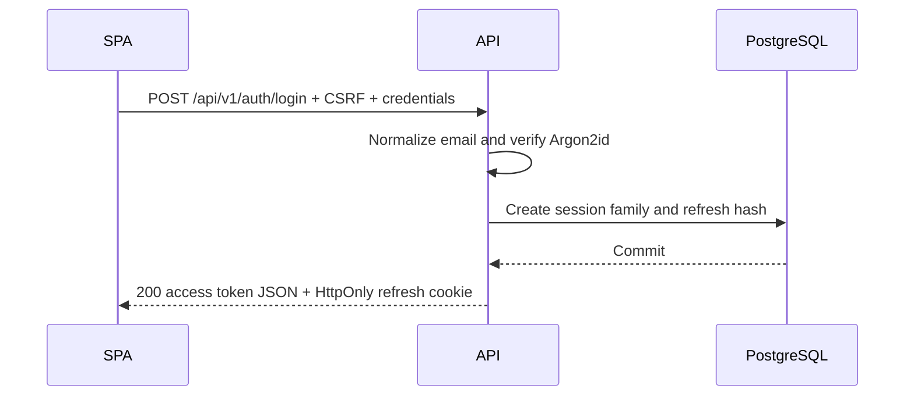
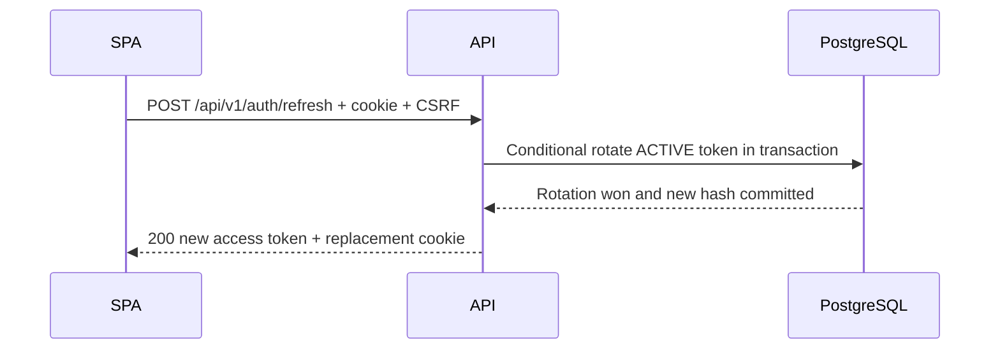
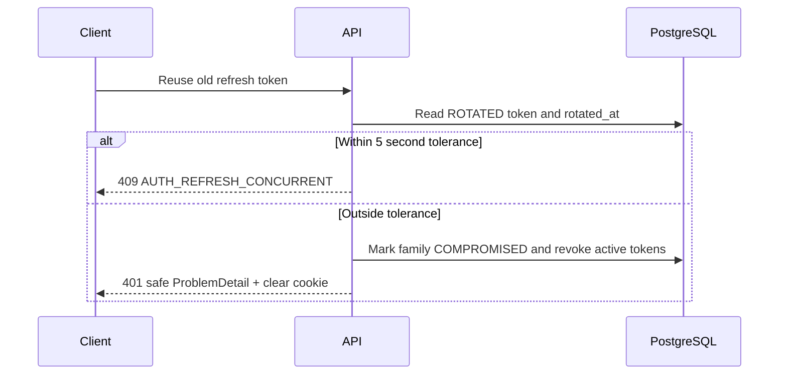
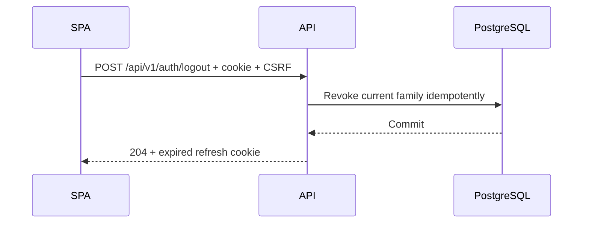
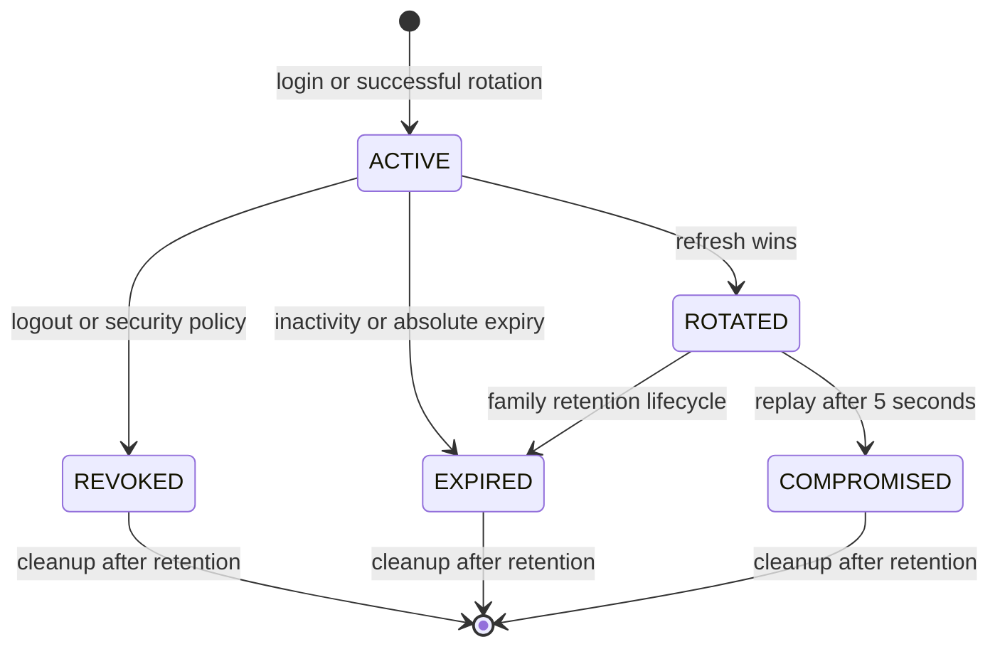

# ADR 0001: Authentication và refresh token

- **Status:** Accepted
- **Date:** 2026-08-03
- **Ticket:** BF-010

## Context

BookFlow cần xác thực người dùng toàn cục bằng email/password, hỗ trợ nhiều thiết bị và có khả năng thu hồi phiên khi token bị đánh cắp. Đây là quyết định thiết kế; BF-010 không thêm Spring Security, endpoint, schema, migration hay mã JWT.

Ba khái niệm phải tách biệt:

- **Authentication** xác định người dùng là ai và thuộc phạm vi ADR này.
- **Authorization** quyết định người dùng được làm gì và được thiết kế ở ticket sau.
- **Tenant isolation** quyết định dữ liệu của business nào được truy cập và thuộc BF-011 hoặc ticket triển khai sau.

Identity của user là global. Membership, `business_id`, tenant role và permission không thuộc token hoặc data model credential trong BF-010.

## Assumptions

- SPA và API mặc định được triển khai same-site; trường hợp cross-site phải review lại ADR.
- PostgreSQL là source of truth cho refresh session và mọi quyết định rotate/revoke.
- Redis chỉ có thể hỗ trợ rate limiting hoặc cache; Redis không quyết định session còn hợp lệ.
- HTTPS là bắt buộc ở staging/production.
- Đồng hồ các node được đồng bộ; JWT clock skew tối đa là 30 giây.
- Các TTL, issuer, audience và key location sẽ là cấu hình theo môi trường ở ticket triển khai, nhưng không được nới lỏng validation.

## Decision

BookFlow dùng kiến trúc lai:

- Access token là JWT ký bất đối xứng bằng RS256, sống ngắn và được gửi qua `Authorization: Bearer <access-token>`.
- Refresh token là chuỗi opaque ngẫu nhiên, được rotate sau mỗi lần dùng và chỉ gửi bằng cookie HttpOnly.
- PostgreSQL lưu session và SHA-256 hash của refresh token, không lưu raw token.
- Access token được giữ trong memory của frontend; không lưu vào localStorage, sessionStorage hoặc cookie.
- Refresh cookie được bảo vệ bằng Spring Security CSRF, policy cookie và exact-origin CORS.

### Access token

Mặc định:

| Thuộc tính | Quyết định |
|---|---|
| TTL | 10 phút, có thể cấu hình |
| Transport | Header `Authorization: Bearer` |
| Frontend storage | Chỉ trong memory; mất khi reload hoặc đóng tab |
| Signing | RS256, chỉ chấp nhận đúng algorithm cấu hình |
| Header | `alg=RS256`, `kid` bắt buộc, `typ=at+jwt` |
| Clock skew | Tối đa 30 giây |

Claims tối thiểu:

- `iss`: issuer logic cố định `urn:bookflow:auth`.
- `sub`: UUID của user global.
- `aud`: `bookflow-api`.
- `iat`, `exp`.
- `jti`: UUID duy nhất của access token.
- `sid`: UUID của authentication session/token family.

Decoder phải validate signature, allowlist algorithm, `kid`, issuer, audience, subject hợp lệ, expiry, token type và clock skew. Không chấp nhận `alg=none`, không tin `alg` do client quyết định và không tải key từ URL trong JOSE header.

JWT không chứa password/hash, refresh token/hash, email/PII không cần thiết, booking, role, permission, `business_id`, `tenant_id` hoặc membership. Access token không xuất hiện trong URL, query string hay log.

### JWT key management và rotation

- Private key chỉ dùng để ký; public key dùng để verify.
- Private key không được commit, không đặt trong `application.yml`, không ghi log và không sinh trong BF-010.
- Production lấy private key từ secret manager hoặc mounted secret. Local dùng development key riêng nhưng vẫn không commit private key.
- Mỗi key có `kid` không chứa thông tin nhạy cảm. Verifier chỉ tra key từ trust store cấu hình sẵn.
- Khi rotate, signer chuyển sang key mới; verifier tạm tin public key hiện tại và public key trước đó.
- Chỉ gỡ public key cũ sau khi mọi access token do key đó ký đã hết TTL cộng clock skew, tối thiểu 10 phút 30 giây kể từ lần ký cuối.
- Key compromise kích hoạt rotation khẩn cấp, security event và đánh giá revoke session. JWT đã phát hành không tự mất hiệu lực ngay; operation rủi ro cao có thể cần re-authentication hoặc session-state check ở ticket tương lai.

### Refresh token

- Sinh bằng CSPRNG với ít nhất 256 bit entropy.
- Encode base64url không padding hoặc format tương đương.
- Không chứa user ID, role, tenant, session state hay dữ liệu có thể đọc.
- Database chỉ lưu SHA-256 hash và unique constraint trên hash.
- SHA-256 phù hợp vì input là token ngẫu nhiên entropy cao; password do người dùng chọn phải dùng Argon2id.
- Raw token chỉ tồn tại ngắn trong memory server để tạo `Set-Cookie`; không trả trong JSON và không log cookie.

### Cookie policy

| Thuộc tính | Policy |
|---|---|
| `HttpOnly` | Luôn bật |
| `Secure` | Bắt buộc ở staging/production |
| `SameSite` | `Lax` cho deployment same-site |
| `Domain` | Không đặt; cookie host-only |
| `Path` | `/api/v1/auth` |
| `Max-Age`/`Expires` | Không vượt absolute session expiry |

HTTP localhost có thể dùng cấu hình local với `Secure=false`; production không được kế thừa ngoại lệ này. Nếu frontend/API chuyển sang cross-site, `SameSite=None` phải đi cùng `Secure`, CORS phải dùng exact allowlist và CSRF policy phải được review lại. Không dùng wildcard domain.

### Session lifetime

- Access token TTL: 10 phút.
- Refresh inactivity timeout: 7 ngày tính từ lần refresh hợp lệ gần nhất.
- Absolute session lifetime: 30 ngày tính từ login.
- Refresh thành công kéo `inactivity_expires_at` nhưng không vượt `absolute_expires_at`.
- Giá trị sẽ cấu hình được. TTL ngắn giảm cửa sổ lạm dụng; rotation và inactivity timeout cân bằng trải nghiệm nhiều thiết bị với khả năng thu hồi.

### Token family và rotation

Mỗi login thành công tạo một authentication session/token family riêng. Một user có thể có nhiều family cho nhiều thiết bị.

Rotation phải nằm trong một transaction PostgreSQL:

1. Hash token nhận được và tìm đúng record/family.
2. Validate session chưa revoked, expired hoặc compromised.
3. Atomic conditional update chỉ chuyển token `ACTIVE` sang `ROTATED`.
4. Ghi `rotated_at`, sinh refresh token mới, lưu hash mới và liên kết `parent_token_id`/`replaced_by_token_id`.
5. Token mới giữ nguyên `family_id`; inactivity expiry mới không vượt absolute expiry.
6. Commit trước khi trả access token và refresh cookie mới.

Token cũ không bao giờ cấp access token lần thứ hai. Database constraint/transaction là lớp bảo vệ cuối cùng; không dùng distributed lock làm source of truth.

### Concurrent refresh và replay

Hai request đồng thời cạnh tranh trên conditional update `status=ACTIVE`; chỉ một request thắng. Request thua không rotate và không nhận token.

- Nếu token `ROTATED` được dùng lại trong tối đa 5 giây kể từ `rotated_at`, coi là race nhiều tab: trả HTTP 409 với `AUTH_REFRESH_CONCURRENT`, không phát token, không xóa cookie mới và không revoke family.
- Token cũ vẫn hoàn toàn invalid trong cửa sổ này; mỗi retry không gia hạn cửa sổ. Client phải dùng single-flight refresh và retry bằng cookie mới. Rate limit vẫn áp dụng.
- Nếu reuse xảy ra sau 5 giây, coi là replay: không phát token, đánh dấu family `COMPROMISED`, revoke toàn bộ token active trong family, ghi audit event, xóa cookie phù hợp và yêu cầu login lại.

Đây là trade-off có chủ đích: cửa sổ ngắn tránh logout nhầm do race browser nhưng có residual risk kẻ tấn công dùng token cũ trong 5 giây không làm family bị revoke. Kẻ tấn công vẫn không nhận token mới.

## Token lifecycle diagrams

### Login

### Refresh thành công

### Phát hiện reuse

### Logout

### State machine

## Password authentication

### Password storage

- Argon2id với salt ngẫu nhiên riêng cho mỗi hash.
- Baseline tối thiểu: memory 19 MiB, iterations 2, parallelism 1.
- Ticket triển khai phải benchmark và có thể tăng cost; không hạ thấp baseline nếu chưa security review.
- Không lưu plaintext, không mã hóa để giải mã lại, không dùng MD5/SHA-1/SHA-256 trực tiếp, không log password.
- Khi parameters được tăng, hash cũ được rehash sau lần login thành công.

### Password policy

- Tối thiểu 15 ký tự khi password là single factor; cho phép ít nhất 64 ký tự.
- Cho phép spaces, paste, autofill, password manager và Unicode.
- Unicode được chuẩn hóa NFC trước khi hash; không trim, lowercase hoặc biến đổi khác.
- Không ép uppercase/lowercase/number/symbol, không đổi định kỳ vô lý và không dùng security question.
- Password mới được so với blocklist phổ biến/đã lộ bằng cơ chế không làm lộ password.

### Email identity

- Email được trim whitespace, chuẩn hóa Unicode NFC và case-fold nhất quán bằng locale trung lập để tạo `normalized_email`.
- Lookup và unique constraint dùng `normalized_email`, không phân biệt hoa thường.
- Không áp dụng quy tắc riêng của Gmail như bỏ dấu chấm hoặc phần `+tag`.
- Có thể giữ email hiển thị riêng, nhưng không trộn membership business vào credential.

### Login protection

- Email không tồn tại và password sai đều trả HTTP 401, code `AUTH_INVALID_CREDENTIALS`, với cùng public detail.
- Với account không tồn tại, thực hiện dummy Argon2id verification để giảm timing difference.
- Rate limit kết hợp IP và normalized account identifier, có progressive delay/temporary throttle; không permanent-lock account.
- Không dựa duy nhất vào IP vì NAT/proxy. Redis có thể giữ counter nhưng PostgreSQL/session policy vẫn là authority.
- Hành vi đáng ngờ tạo audit event; không log raw password, token hoặc raw email nếu không cần.

## CSRF, CORS và XSS

### CSRF

- Dùng Spring Security CSRF, ưu tiên `CookieCsrfTokenRepository` hoặc cơ chế chính thức tương đương; không tự phát minh token.
- CSRF token nằm trong cookie riêng không HttpOnly và SPA gửi lại qua `X-XSRF-TOKEN`.
- Login, refresh, logout, logout-all và mọi cookie-authenticated state-changing request phải validate CSRF. Login được bảo vệ vì response thiết lập session cookie.
- `GET /api/v1/auth/csrf` dự kiến cấp/khởi tạo CSRF token, không trả authentication token và không thay đổi state nghiệp vụ.
- Origin/Referer hoặc Fetch Metadata được kiểm tra như defense in depth; không dùng GET để đổi state.

### CORS

- Exact origin allowlist theo environment; local và production tách riêng.
- Không dùng `Access-Control-Allow-Origin: *` khi `credentials=true`, không phản chiếu Origin tùy ý.
- Chỉ allow method/header cần thiết; không hard-code localhost vào production policy.

### XSS

Access token trong memory giảm persistence và HttpOnly ngăn JavaScript đọc trực tiếp refresh token. Tuy vậy, XSS vẫn có thể gửi request trong phiên của nạn nhân; frontend vẫn cần output encoding, CSP và tránh unsafe HTML. localStorage không được coi là nơi lưu token an toàn.

## Logout và revocation

- Logout hiện tại revoke family hiện tại, xóa cookie với cùng Path/SameSite và `Max-Age=0`, trả 204 idempotent.
- Logout-all revoke mọi family của user.
- Password change, password reset hoặc account disabled revoke mọi refresh session.
- Replay revoke family bị ảnh hưởng; security policy có thể revoke toàn bộ family sau event nghiêm trọng.
- Không lưu raw refresh token trong denylist.
- Access JWT sống tối đa 10 phút và ban đầu không lookup DB trên mọi request. Logout ngăn cấp token mới nhưng access token đã phát hành có thể dùng đến `exp`.
- Operation rủi ro cao có thể yêu cầu re-authentication, session-state check hoặc denylist có TTL trong ticket tương lai.

## Data design

Đây là data dictionary khái niệm, không phải schema hay migration.

### User credential/account

| Field | Kiểu khái niệm | Quy tắc |
|---|---|---|
| `id` | UUID | Identity global, dùng làm JWT `sub` |
| `normalized_email` | text | Unique, case-insensitive theo policy trên |
| `password_hash` | text | Encoded Argon2id; không chứa plaintext |
| `status` | enum | Ví dụ ACTIVE, DISABLED; chi tiết ở ticket triển khai |
| `password_changed_at` | instant | Dùng cho revocation/security policy |
| `last_login_at` | instant nullable | Chỉ cập nhật sau login thành công |
| `created_at`, `updated_at` | instant | UTC audit timestamps |

Credential không chứa `business_id`, role hay membership.

### Authentication session

| Field | Quy tắc |
|---|---|
| `id` | UUID; dùng làm JWT `sid` và token `family_id` |
| `user_id` | FK logic tới account, có index |
| `status` | ACTIVE, REVOKED, EXPIRED hoặc COMPROMISED |
| `issued_at`, `last_used_at` | UTC instants |
| `inactivity_expires_at` | Tối đa 7 ngày từ lần dùng hợp lệ, không vượt absolute expiry |
| `absolute_expires_at` | 30 ngày từ login |
| `revoked_at`, `revoke_reason` | Nullable; reason là enum an toàn, không chứa credential |
| `created_at`, `updated_at` | UTC audit timestamps |
| Device metadata | Optional sanitized label; user-agent chỉ lưu hash/metadata tối thiểu |

### Refresh token record

| Field | Quy tắc |
|---|---|
| `id` | UUID nội bộ |
| `user_id` | Có index |
| `family_id` | FK logic tới session, có index |
| `token_hash` | SHA-256, unique |
| `parent_token_id` | Nullable, liên kết token trước |
| `replaced_by_token_id` | Nullable, liên kết token mới |
| `status` | ACTIVE, ROTATED, REVOKED, EXPIRED, COMPROMISED |
| `issued_at`, `last_used_at` | UTC instants |
| `inactivity_expires_at`, `absolute_expires_at` | Snapshot/constraint theo family |
| `rotated_at`, `revoked_at` | Nullable UTC instants |
| `revoke_reason` | Nullable enum an toàn |
| `created_at`, `updated_at` | UTC audit timestamps |

Chỉ token `ACTIVE` được rotate. Transaction dùng conditional update hoặc row lock; unique hash và state transition được bảo vệ ở database.

### Retention và privacy

- Record token terminal được giữ đến 30 ngày sau `absolute_expires_at` của family để hỗ trợ replay investigation, sau đó cleanup job xóa.
- Sanitized device label, user-agent hash và IP rút gọn nếu thu thập chỉ giữ tối đa 30 ngày.
- Security audit event giữ 90 ngày theo policy ban đầu, không chứa credential, raw token/cookie hoặc password.
- Cleanup job và legal/privacy review được triển khai sau; không giữ IP/user-agent vô thời hạn.

## API contract dự kiến

Các endpoint dưới đây chưa tồn tại trong BF-010. Lỗi tiếp tục dùng ProblemDetail BF-008 với `type`, `title`, `status`, `detail`, `instance`, `code`, `timestamp`; detail không lộ token/hash/state database.

### `POST /api/v1/auth/login`

- Request JSON: `email`, `password`.
- Có CSRF protection vì endpoint tạo cookie.
- Thành công: HTTP 200, JSON `accessToken`, `tokenType: Bearer`, `expiresIn`; `Set-Cookie` chứa refresh token.
- Refresh token không có trong body.
- Lỗi: 400 validation, 401 `AUTH_INVALID_CREDENTIALS`, 429 `AUTH_RATE_LIMITED`; không tiết lộ account tồn tại.

### `POST /api/v1/auth/refresh`

- Đọc refresh token từ HttpOnly cookie, yêu cầu CSRF; không yêu cầu access token còn hiệu lực.
- Thành công: rotate, HTTP 200 với access token mới và replacement cookie.
- Lỗi dự kiến: 401 `AUTH_REFRESH_MISSING`, `AUTH_REFRESH_INVALID`, `AUTH_SESSION_EXPIRED`, `AUTH_SESSION_REVOKED`; 409 `AUTH_REFRESH_CONCURRENT` retryable.
- Các lỗi 401 dùng detail chung, không nêu hash, token value hay trạng thái record.

### `POST /api/v1/auth/logout`

- Có CSRF, revoke family hiện tại nếu xác định được và xóa cookie.
- Idempotent HTTP 204 kể cả session đã hết/revoked; không tiết lộ token trước đó hợp lệ.

### `POST /api/v1/auth/logout-all`

- Yêu cầu access token hợp lệ và CSRF vì cookie/session bị thay đổi.
- Revoke mọi refresh session của user, xóa cookie hiện tại, trả HTTP 204.
- Access JWT đã phát hành có thể còn hiệu lực đến `exp`.

### `GET /api/v1/auth/csrf`

- Contract dự kiến để SPA khởi tạo CSRF token.
- Không trả access/refresh token và không tạo authentication session.

## Threat model

Tài sản chính là password hash, refresh session, signing key, access token, identity và audit trail. Trust boundaries gồm browser/API, API/PostgreSQL, API/Redis và secret store. Threat model chi tiết, abuse cases, risk matrix và residual risks nằm tại [Authentication security review](../security/authentication-security-review.md).

Các control chủ đạo:

- Argon2id, generic login error và layered rate limiting chống credential attacks.
- Short-lived JWT, strict validation và asymmetric key rotation giảm token/signing risk.
- Opaque rotating refresh token, hashed storage, family replay detection và transaction PostgreSQL giảm session theft/replay.
- Host-only HttpOnly cookie, Spring CSRF và exact-origin CORS giảm browser attacks.
- Log redaction, URL prohibition và retention giới hạn giảm credential/privacy leakage.

## Test strategy

BF-010 không thêm authentication test. Ticket triển khai phải có:

- **Unit:** Argon2id hash/verify và salt; email/password normalization; JWT claims/validation; issuer/audience/algorithm/signature/expiry/type; cookie attributes; token hashing; state transitions; ProblemDetail không lộ credential.
- **PostgreSQL/Testcontainers:** login tạo family; atomic rotation; token cũ không dùng lại; replay sau 5 giây revoke family; concurrent race chỉ một request thắng; race trong 5 giây không revoke nhầm; logout/logout-all; password/account revocation; unique normalized email; transaction rollback; cleanup.
- **HTTP/security:** cookie không xuất hiện trong JSON; đúng HttpOnly/Secure/SameSite/Path; CSRF/Origin/CORS; generic 401; 429; access token không vào URL; captured log sạch; OpenAPI không có credential; BF-008 unknown route không regression.
- **Key/token:** từ chối `alg=none`, algorithm ngoài allowlist, sai/unknown `kid`, signature/issuer/audience sai, expired/not-yet-valid; key cũ chỉ trong rotation window; không dùng access token như refresh hoặc ngược lại.
- **Concurrency:** dùng executor và barrier để hai transaction cạnh tranh thật; assert đúng một conditional update thắng; không dùng test tuần tự hoặc sleep dài giả concurrency.

Chi tiết mapping test/risk nằm trong security review.

## Alternatives considered

| Alternative | Quyết định và trade-off |
|---|---|
| Access token trong localStorage | Loại bỏ: đơn giản và sống qua reload nhưng XSS có thể đọc/persist token. Memory giảm persistence, đổi lại frontend phải refresh sau reload. |
| Access token trong HttpOnly cookie | Loại bỏ cho access token: JS không đọc được nhưng mọi API bearer-by-cookie trở thành CSRF-sensitive và khó tách refresh policy. Memory bearer giữ CSRF tập trung ở auth cookie endpoints; XSS vẫn là residual risk. |
| Stateful server session hoàn toàn | Chưa chọn: revoke tức thì và đơn giản cho browser, nhưng thêm lookup/state trên mọi request và operational burden. Short-lived JWT phù hợp modular monolith/API, còn refresh vẫn stateful để revoke. |
| JWT refresh token | Loại bỏ: self-contained nhưng khó rotate/revoke/replay-detect an toàn và dễ nhầm token type. |
| Opaque refresh token | Chọn: server có state, DB lookup và cleanup phức tạp hơn nhưng hỗ trợ hash storage, family và revocation rõ ràng. |
| Không rotate refresh token | Loại bỏ: giảm write/concurrency complexity nhưng token bị đánh cắp dùng được đến expiry và không phát hiện replay. |
| Lưu raw refresh token | Loại bỏ: lookup dễ hơn nhưng database leak trở thành session compromise trực tiếp. Hash của token entropy cao cung cấp defense in depth. |
| HS256 | Loại bỏ mặc định: nhanh và đơn giản nhưng mọi verifier giữ shared signing secret, tăng blast radius. RS256 tách signer/verifier và hỗ trợ distribution/rotation tốt hơn, đổi lại key ops phức tạp hơn. |
| Redis là session source of truth | Loại bỏ: nhanh nhưng eviction/availability/persistence làm yếu consistency và audit. PostgreSQL transaction là authority; Redis chỉ hỗ trợ counter/cache. |
| Immediate JWT denylist | Chưa chọn mặc định: revoke nhanh nhưng buộc lookup trên mọi request và thêm state/cleanup. JWT 10 phút giảm burden; high-risk action có thể thêm check/denylist TTL sau. |
| Strict replay detection không tolerance | Loại bỏ: phát hiện mạnh nhất nhưng race nhiều tab có thể compromise/revoke nhầm family. Cửa sổ 5 giây không cấp token cho loser, tăng UX/testability với residual detection delay nhỏ. |
| Roles hoặc `business_id` trong JWT | Hoãn đến BF-011: giảm lookup nhưng dễ stale privilege và khóa thiết kế tenant quá sớm. Token BF-010 chỉ mang global identity/session. |

## Consequences

### Positive

- Access token stateless, sống ngắn; refresh session có thể revoke và audit.
- Database transaction xử lý rotation/race có thể kiểm thử deterministically.
- Multi-device được mô hình hóa bằng family riêng.
- Token payload tối thiểu tránh coupling authentication với tenant authorization.

### Costs

- Cần key lifecycle, CSRF flow, cookie policy, cleanup và nhiều concurrency test.
- Frontend phải single-flight refresh và chỉ giữ access token trong memory.
- PostgreSQL có write mỗi lần refresh.
- Logout không thu hồi ngay JWT đã phát hành.

### Residual risks

- Access token bị đánh cắp dùng được tối đa TTL còn lại.
- XSS có thể hành động thay user dù không đọc được refresh cookie.
- Reuse trong tolerance window không revoke family, dù không cấp token cho request thua.
- Signing-key compromise cần incident response; rotation không thu hồi tự động mọi JWT đã phát hành.
- Rate limit phân tán phụ thuộc thiết kế Redis/failover tương lai.
- Không có MFA, passkey, email verification hay account recovery trong BF-010.

## Security considerations

- Không log password, raw token, cookie, private key, decoded sensitive claim hoặc database hash.
- Audit event ghi event type, user/session identifiers tối thiểu, timestamp, outcome và metadata đã sanitize; không ghi credential.
- Response và OpenAPI không dùng credential example thật.
- Security-sensitive comparison dùng constant-time primitive phù hợp.
- Account disabled/password changed phải ảnh hưởng refresh session; residual access-JWT window được công bố rõ.
- Tenant/role validation tuyệt đối không suy ra từ token BF-010; BF-011 phải định nghĩa authority riêng.

## Acceptance criteria cho ticket triển khai

- [x] Kiến trúc access JWT và opaque refresh token đã chốt.
- [x] TTL, storage, cookie, rotation, family, replay và concurrent behavior đã chốt.
- [x] Password/email policy và Argon2id baseline đã chốt.
- [x] RS256, strict JWT validation và key rotation đã chốt.
- [x] CSRF/CORS/XSS policy đã chốt.
- [x] Data model, API contract, logout/revocation và retention đã chốt ở mức khái niệm.
- [x] Threat model, test strategy, alternatives và residual risks đã được review ở mức thiết kế.

Các checkbox xác nhận quyết định thiết kế, không tuyên bố control đã tồn tại trong runtime.

## Deferred work

- Triển khai Spring Security, Argon2id, JWT encoder/decoder, repositories, migrations và endpoints.
- BF-011: authorization, tenant isolation, membership và role/permission model.
- Frontend login state, single-flight refresh, CSP và auth UX.
- MFA/passkeys, email verification, reset password, active-session UI.
- Secret manager, production key ceremony, emergency key compromise runbook.
- Redis rate limiter, cleanup jobs, observability và security audit pipeline.

## Official references

Truy cập ngày 2026-08-03:

- [OAuth 2.0 Security Best Current Practice — RFC 9700](https://datatracker.ietf.org/doc/rfc9700/)
- [JSON Web Token — RFC 7519](https://datatracker.ietf.org/doc/rfc7519/)
- [JSON Web Token Best Current Practices — RFC 8725](https://datatracker.ietf.org/doc/rfc8725/)
- [OWASP ASVS 5.0](https://owasp.org/www-project-application-security-verification-standard/)
- [OWASP Authentication Cheat Sheet](https://cheatsheetseries.owasp.org/cheatsheets/Authentication_Cheat_Sheet.html)
- [OWASP Password Storage Cheat Sheet](https://cheatsheetseries.owasp.org/cheatsheets/Password_Storage_Cheat_Sheet.html)
- [OWASP Session Management Cheat Sheet](https://cheatsheetseries.owasp.org/cheatsheets/Session_Management_Cheat_Sheet.html)
- [OWASP CSRF Prevention Cheat Sheet](https://cheatsheetseries.owasp.org/cheatsheets/Cross-Site_Request_Forgery_Prevention_Cheat_Sheet.html)
- [NIST SP 800-63B](https://pages.nist.gov/800-63-4/sp800-63b.html)
