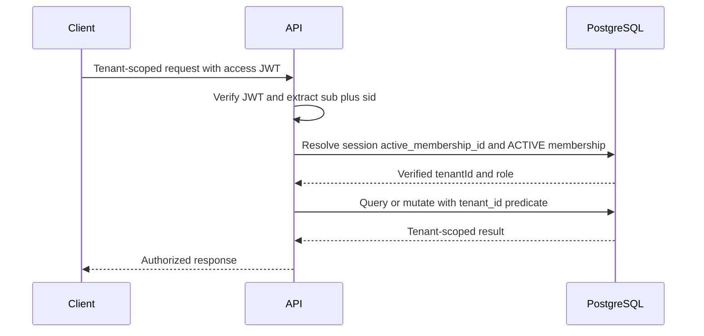
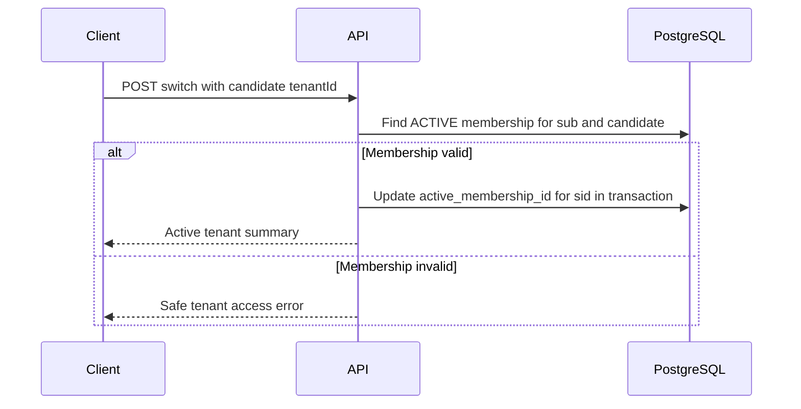

# ADR 0002: Multi-tenancy và membership

- **Status:** Accepted
- **Date:** 2026-08-05
- **Ticket:** BF-011

## Context

BookFlow dùng shared database/shared schema. Một user global có thể làm việc với nhiều business; mỗi business là một tenant độc lập. Sai sót về tenant có thể làm lộ hoặc thay đổi dữ liệu của doanh nghiệp khác, nên isolation không thể dựa vào giá trị `tenant_id` do client gửi.

ADR 0001 đã tách authentication khỏi authorization và tenant isolation. JWT access token của BF-010 chỉ xác nhận identity (`sub`) và authentication session (`sid`), không chứa business, role hay permission. ADR này chốt cách lấy tenant context từ session/membership và cách mọi tài nguyên business được scope.

## Decision

### Ranh giới tenant và thuật ngữ

- **Tenant là business.** `tenant_id` là UUID của business/tenant đang hoạt động.
- `tenant_id` là tên cột chuẩn cho mọi bảng dữ liệu nghiệp vụ thuộc business. Không thêm đồng thời `business_id` và `tenant_id` vào cùng một tài nguyên.
- Các tài liệu cũ dùng `business_id` để diễn đạt business boundary; yêu cầu đó được đáp ứng về mặt ngữ nghĩa bằng predicate bắt buộc trên `tenant_id` vì `tenant_id` chính là ID business.
- Bảng `users`, authentication session/refresh token và dữ liệu platform thật sự global là ngoại lệ hợp lệ; chúng không sở hữu dữ liệu business.
- Bảng business gốc định nghĩa tenant (`businesses.id`) không tự chứa `tenant_id`. Mọi bảng nghiệp vụ con, kể cả booking hoặc audit event gắn với business, phải có `tenant_id NOT NULL`.

### Membership

Một user có thể có nhiều membership, mỗi membership liên kết đúng một user với đúng một tenant.

| Thuộc tính khái niệm | Quy tắc |
|---|---|
| `id` | UUID của membership |
| `user_id` | Identity global, bắt buộc |
| `tenant_id` | Business/tenant, bắt buộc |
| `role` | `OWNER`, `ADMIN` hoặc `STAFF` |
| `status` | Ít nhất `ACTIVE`, `SUSPENDED`, `REVOKED` |
| `created_at`, `updated_at` | UTC timestamps |
| `revoked_at`, `revoked_by` | Nullable, audit được khi thu hồi |

Ràng buộc tối thiểu:

- `UNIQUE (user_id, tenant_id)` để một user không có hai membership trong cùng tenant.
- `UNIQUE (id, user_id)` để session có thể tham chiếu membership và đồng thời chứng minh membership thuộc đúng user.
- `INDEX (tenant_id, status, role)` cho authorization/membership management và `INDEX (user_id, status)` cho danh sách business của user.
- Tenant chỉ hợp lệ khi business/tenant còn active; membership bị revoke/suspended không thể làm tenant context.

### Role membership

Role chỉ là role trong một tenant, không phải role toàn hệ thống.

| Khả năng | OWNER | ADMIN | STAFF |
|---|---:|---:|---:|
| Xem và vận hành dữ liệu tenant theo scope nghiệp vụ sau này | Có | Có | Có, giới hạn theo policy module |
| Quản lý cấu hình business/chi nhánh | Có | Có | Không mặc định |
| Quản lý membership STAFF | Có | Có | Không |
| Cấp, hạ hoặc thu hồi OWNER/ADMIN | Có | Không | Không |
| Chuyển owner | Có, transaction an toàn | Không | Không |
| Xóa/đóng business | Có, ticket riêng | Không | Không |

- `OWNER > ADMIN > STAFF` là hierarchy tối thiểu, nhưng authorization phải kiểm tra permission/policy cụ thể thay vì chỉ so sánh ordinal role.
- ADMIN không được tự nâng mình, tạo OWNER/ADMIN khác, sửa hoặc revoke role bằng/higher role.
- STAFF không được quản lý membership, cấu hình tenant hoặc chuyển tenant cho user khác.
- Tenant có đúng một `OWNER` active. Chuyển owner là transaction: kiểm tra owner đích có membership active, chuyển role cho đích và hạ/thu hồi owner cũ sao cho không có thời điểm commit nào tenant không owner hoặc có hai owner active.
- System Admin là vai trò platform, không phải membership và không được bypass tenant isolation mặc định. Nếu cần break-glass support, đó là ticket/ADR riêng, phải có just-in-time approval và audit bất biến.

### Tenant context từ session và membership

Tenant context không lấy từ `tenant_id` ở request body, query string, path, header hoặc claim do client tự khai báo.

1. JWT được verify theo ADR 0001 để lấy `sub` và `sid`.
2. `sid` xác định authentication session ở server. Session giữ `active_membership_id` nullable.
3. Resolver tenant đọc session và membership trong PostgreSQL, kiểm tra `session.user_id = sub`, membership `ACTIVE`, membership thuộc user, và tenant còn active.
4. Chỉ khi toàn bộ điều kiện đúng, resolver tạo `TenantContext` bất biến gồm `tenantId`, `membershipId`, `userId`, `role` và `sessionId`.
5. Tenant-scoped application service/repository chỉ nhận `TenantContext` hoặc `tenantId` lấy từ context đó; không nhận tenant ID tự do từ client.

Điều này thêm một database lookup cho endpoint tenant-scoped sau JWT validation. Đây là trade-off có chủ đích để role/membership revoke và business switch có hiệu lực ngay. Cache sau này chỉ là tối ưu hóa có version/invalidation và PostgreSQL vẫn là authority; cache miss/outage không được cấp access tenant sai.

### Chuyển business

Mỗi authentication session có active membership riêng, vì vậy một user có thể chọn business khác nhau trên các thiết bị/tab session khác nhau.

- Contract tương lai có thể dùng `POST /api/v1/tenants/{tenantId}/switch`; `tenantId` ở path chỉ là **candidate**, không phải authority.
- Server lookup `ACTIVE membership` với `user_id = sub` và `tenant_id = candidate`, đồng thời kiểm tra tenant active.
- Trong transaction, update `active_membership_id` của đúng session (`sid`, `user_id`) bằng membership đã xác thực; ghi audit event.
- Response chỉ trả tenant summary/role đã xác thực. Không phát hành context nếu user không có membership.
- Nếu không có active membership, tenant endpoint trả ProblemDetail dự kiến `TENANT_CONTEXT_REQUIRED`. Candidate không hợp lệ hoặc membership inactive trả `TENANT_ACCESS_DENIED` với detail chung, không xác nhận business có tồn tại.
- Không có generic `X-Tenant-Id` header. Payload tạo/cập nhật resource không được sở hữu `tenant_id`; server gán từ context.

### Quy tắc isolation bắt buộc

1. **Read:** mọi query tenant-owned luôn chứa `tenant_id = :contextTenantId`, kể cả lookup theo resource UUID. Không `findById` trước rồi kiểm tra tenant ở application memory.
2. **Create:** bỏ qua/từ chối `tenant_id` do client gửi; server gán tenant từ `TenantContext`.
3. **Update/Delete:** SQL/repository command phải predicate cả resource ID và `tenant_id`, sau đó kiểm tra affected row count. Không có mutation unscoped.
4. **Join:** cả hai phía của join phải cùng tenant qua predicate/composite foreign key; không dựa vào ID toàn cục để suy luận isolation.
5. **Cross-tenant resource:** scope query khiến resource ngoài tenant trông như không tồn tại (`RESOURCE_NOT_FOUND`) để hạn chế enumeration. Không trả object hoặc metadata tenant khác.
6. **Async/event/audit:** message, job và audit record tenant-owned phải mang `tenant_id` được tạo server-side; consumer phải resolve/validate context trước truy cập.
7. **Observability:** log/tracing có thể chứa `tenant_id` đã xác thực khi cần điều tra, nhưng không dùng raw client tenant ID, credential hoặc dữ liệu PII không cần thiết.

### Database invariants, constraints và indexes

Đây là thiết kế cho migration tương lai, không phải SQL được thực thi trong BF-011.

| Thành phần | Invariant bắt buộc |
|---|---|
| Business/tenant | `businesses.id` là tenant UUID; status active được kiểm tra khi tạo context |
| Membership | Foreign key tới user và business; unique `(user_id, tenant_id)`; role/status constrained; đúng một owner active |
| Bảng tenant-owned | `tenant_id UUID NOT NULL`, FK tới business; index bắt đầu bằng `tenant_id` cho query path phổ biến |
| Identity cục bộ | Nếu dùng UUID global `id`, thêm `UNIQUE (tenant_id, id)` để composite FK có thể chứng minh cùng tenant |
| Child-parent | FK `(tenant_id, parent_id)` tham chiếu `parent(tenant_id, id)`; chặn liên kết chéo tenant ở database |
| Mutation | Conditional `WHERE tenant_id = :tenantId`; expected affected rows là 1 |
| Ownership transfer | Transaction và locking/constraint kiểm soát một owner active tại commit |

Ví dụ khái niệm: `employees(tenant_id, branch_id)` phải tham chiếu `branches(tenant_id, id)`, không chỉ `branches(id)`. Nhờ đó employee của tenant A không thể liên kết branch của tenant B dù application có lỗi predicate.

PostgreSQL Row-Level Security không là control chính trong BF-011. RLS với shared service account và connection pool chỉ được dùng như defense-in-depth sau một ADR riêng về `SET LOCAL`, transaction boundary, owner bypass và test policy. Thiết kế hiện tại không được giả định RLS sẽ bù cho query thiếu tenant predicate.

### Revocation, role change và race condition

- Resolver kiểm tra membership/session state cho mỗi request tenant-scoped; revoke/suspend có hiệu lực từ request tiếp theo.
- Role change hoặc business disable phải transactionally làm active context không còn hợp lệ và tạo audit event.
- Switch tenant racing với revoke membership: conditional update chỉ succeeds khi membership vẫn active và thuộc user/session; request sau resolve lại state và fail closed nếu revoked.
- Chuyển owner racing với revoke/demotion phải serialize bằng row lock/constraint và test concurrency; không dùng distributed lock là bảo vệ cuối cùng.

## Data flow

## Threat model

Threat model, abuse cases, residual risks, security checklist và test matrix chi tiết nằm tại [Multi-tenancy security review](../security/multi-tenancy-security-review.md).

Các threat chính gồm forged tenant input, IDOR/BOLA, missing repository predicate, cross-tenant join, role escalation, stale membership, tenant enumeration, bulk mutation và switch/revoke race.

## Test strategy

Ticket triển khai phải có:

- Unit tests cho `TenantContext` immutability, resolver session/membership validation, role policy, context-required/denied mapping và client tenant field rejection.
- Repository/service tests khẳng định mọi tenant-owned read/update/delete nhận scoped context; static architecture test chặn repository method/query không scope tenant.
- PostgreSQL/Testcontainers integration test với ít nhất hai tenant, hai user và một user có hai membership; kiểm tra read/write/delete/join không chéo tenant, composite FK, unique membership, ownership transfer và audit context.
- HTTP/security tests cho forged `tenant_id`, IDOR UUID, invalid switch candidate, resource enumeration, role escalation, session revoke và ProblemDetail không lộ tenant khác.
- Concurrency tests dùng barrier/executor cho switch-vs-revoke, owner transfer và mutation cùng resource; assertion dựa trên transaction/database state, không dùng sleep giả race.

## Alternatives considered

| Alternative | Quyết định và trade-off |
|---|---|
| Tenant ID do client gửi ở header/body/query | Loại bỏ: dễ dùng nhưng direct path tới confused deputy/IDOR; chỉ candidate switch được server validate. |
| `tenant_id` trong JWT và không lookup membership | Loại bỏ: nhanh nhưng role/revocation/switch stale đến token expiry; context session/membership lookup cho hiệu lực gần thời gian thực. |
| Một user chỉ thuộc một business | Loại bỏ: đơn giản hơn nhưng không đáp ứng consultant/franchise/owner nhiều business. |
| Role global trên user | Loại bỏ: quyền phải theo business; global role làm tăng access chéo tenant. |
| Chỉ kiểm tra tenant ở controller | Loại bỏ: service/repository/async path vẫn có thể bypass; predicate phải nằm tại data access boundary. |
| Chỉ application predicate, không constraint composite | Loại bỏ: app bug có thể tạo relationship chéo tenant; composite FK là defense in depth. |
| PostgreSQL RLS là control duy nhất | Loại bỏ: dễ sai với connection pool/shared role; RLS có thể thêm sau nhưng không thay predicate/constraint. |
| Redis làm tenant context authority | Loại bỏ: cache eviction/staleness không phù hợp authorization; PostgreSQL là source of truth. |
| Multi-schema hoặc database-per-tenant | Không chọn cho MVP: isolation mạnh hơn nhưng migration, connection và vận hành phức tạp; shared schema phù hợp quy mô ban đầu khi có invariant nghiêm ngặt. |

## Consequences

### Positive

- Một identity hỗ trợ nhiều business mà không tin tenant input từ browser.
- Revoke, disable, role change và switch có hiệu lực cho endpoint tenant-scoped ở request kế tiếp.
- Predicate, composite FK và transaction tạo nhiều lớp isolation có thể kiểm thử.

### Costs và residual risks

- Tenant-scoped request có lookup session/membership; cần index và có thể cache cẩn thận sau này.
- Sai sót trong migration/query native/async consumer vẫn có thể gây cross-tenant leak nếu không theo convention/test.
- RLS chưa là guardrail runtime; ticket triển khai phải tuân thủ matrix test và database invariants.
- System Admin support, customer public access và permission chi tiết theo module chưa được thiết kế.

## Deferred work

- Spring Security integration, `TenantContext` runtime, endpoint switch và authorization policy code.
- Flyway migrations cho businesses, membership và mọi business resource.
- API/resource contract, OpenAPI operation/security scheme và ProblemDetail code implementation.
- Permission matrix chi tiết theo module, customer/guest access, invitation flow và break-glass support.
- RLS defense-in-depth ADR nếu được chấp thuận sau khi pool/transaction model ổn định.

## Official references

- [OWASP Authorization Cheat Sheet](https://cheatsheetseries.owasp.org/cheatsheets/Authorization_Cheat_Sheet.html)
- [OWASP Insecure Direct Object Reference Prevention Cheat Sheet](https://cheatsheetseries.owasp.org/cheatsheets/Insecure_Direct_Object_Reference_Prevention_Cheat_Sheet.html)
- [PostgreSQL Row Security Policies](https://www.postgresql.org/docs/current/ddl-rowsecurity.html)
- [PostgreSQL Constraints](https://www.postgresql.org/docs/current/ddl-constraints.html)
- [ADR 0001 — Authentication và refresh token](0001-authentication-and-refresh-token.md)
