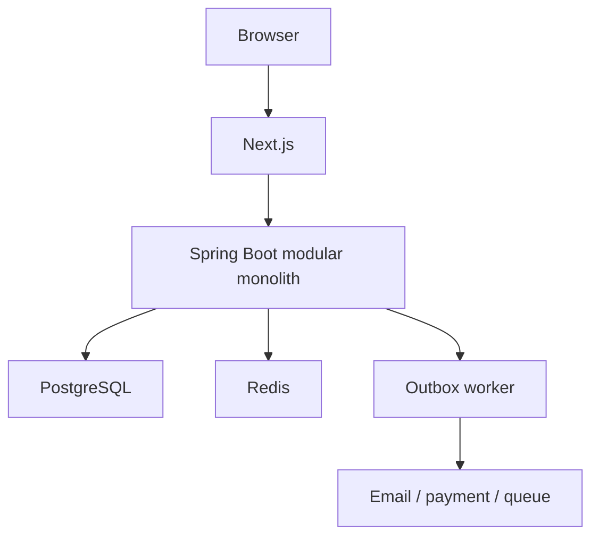

# BookFlow – Kế hoạch triển khai từ số 0 đến Production

> Mục tiêu: xây dựng một sản phẩm SaaS full-stack hoàn chỉnh để vừa học sâu Java/Spring, Next.js, database, bảo mật, testing và DevOps, vừa có một dự án đủ chất lượng để trình bày khi phỏng vấn.
>
> Phiên bản kế hoạch: 28/07/2026

## 1. Cách sử dụng kế hoạch này

Kế hoạch được tổ chức theo **mốc đầu ra**, không chỉ theo số tuần. Không chuyển sang giai đoạn tiếp theo nếu “cổng hoàn thành” của giai đoạn hiện tại chưa đạt.

Nhịp đề xuất:

| Thời gian học | Thời lượng dự kiến |
| --- | --- |
| 12–15 giờ/tuần | Khoảng 24 tuần |
| 20–25 giờ/tuần | Khoảng 16–18 tuần |
| Toàn thời gian | Khoảng 10–12 tuần, nhưng vẫn phải giữ nguyên các cổng test và tài liệu |

Nguyên tắc xuyên suốt:

1. Làm một **modular monolith**, không bắt đầu bằng microservices.
2. Phát triển theo từng lát cắt dọc: database → backend → frontend → test → tài liệu.
3. PostgreSQL là lớp bảo vệ tính nhất quán cuối cùng; Redis không được là cơ chế duy nhất chống đặt trùng.
4. Mỗi chức năng phải có tiêu chí chấp nhận trước khi code.
5. Codex hỗ trợ phân tích, code, test và review; bạn vẫn phải đọc diff và giải thích lại được quyết định.
6. Mỗi tuần phải có một phiên bản chạy được, dù chức năng còn ít.

## 2. Đích đến cuối dự án

BookFlow v1.0 được xem là hoàn thành khi chứng minh được các điều sau:

- Hai doanh nghiệp có thể dùng chung hệ thống nhưng không bao giờ xem hoặc sửa dữ liệu của nhau.
- Owner có thể tạo doanh nghiệp, chi nhánh, nhân viên, dịch vụ và lịch làm việc.
- Khách hàng xem giờ trống, đặt lịch, thanh toán cọc, hủy hoặc đổi lịch.
- Hai mươi request đồng thời đặt cùng một nhân viên và cùng khoảng thời gian chỉ tạo được **một booking hợp lệ**.
- Gửi lại cùng một `Idempotency-Key` không tạo thêm booking hoặc payment.
- Một webhook thanh toán bị gửi lặp nhiều lần chỉ được xử lý nghiệp vụ một lần.
- Booking thành công tạo được sự kiện thông báo mà không bị mất khi tiến trình gửi email tạm thời lỗi.
- Frontend có luồng E2E quan trọng chạy bằng Playwright.
- Pipeline từ `main` có thể test, build image và triển khai lên VPS qua HTTPS.
- Có health check, metrics, log có correlation ID, cảnh báo cơ bản, backup và một lần diễn tập restore.
- Người khác có thể clone repo, đọc README và chạy local mà không cần hỏi tác giả.
- Bạn có thể demo trong 7–10 phút và giải thích được các ADR quan trọng.

## 3. Phạm vi đã chốt

### 3.1. MVP bắt buộc

- Đăng ký, đăng nhập, refresh token, đăng xuất, quên và đặt lại mật khẩu.
- Phân quyền `SYSTEM_ADMIN`, `OWNER`, `MANAGER`, `STAFF`, `CUSTOMER`.
- Tạo doanh nghiệp và quản lý thành viên.
- Quản lý nhiều chi nhánh.
- Quản lý nhân viên, dịch vụ và quan hệ nhân viên–dịch vụ.
- Thiết lập giờ làm việc định kỳ, giờ nghỉ và ngày nghỉ đặc biệt.
- Tính khung giờ trống theo chi nhánh, nhân viên, dịch vụ, buffer và múi giờ.
- Tạo booking giữ chỗ tạm thời, xác nhận, từ chối, hủy, đổi lịch, hoàn thành và đánh dấu vắng.
- Giao diện khách hàng, nhân viên và chủ doanh nghiệp.
- Test cách ly tenant và test tranh chấp booking bằng PostgreSQL thật qua Testcontainers.

### 3.2. Bản v1.0 sau MVP

- Cổng thanh toán giả lập rồi tích hợp một sandbox thật.
- Webhook có xác thực, idempotency và đối soát.
- Email xác nhận và nhắc lịch.
- Transactional Outbox, retry và dead-letter state.
- Redis cho cache/rate limit; chỉ dùng như lớp tối ưu cho giữ chỗ nếu thực sự cần.
- Audit log.
- Review sau khi booking hoàn thành.
- Dashboard doanh thu, tỷ lệ hủy, dịch vụ phổ biến và xuất CSV.
- CI/CD, VPS, domain, HTTPS, monitoring, log tập trung, backup và restore.

### 3.3. Chưa làm trước v1.0

- Microservices toàn hệ thống.
- Kubernetes.
- Mobile app.
- Marketplace tìm doanh nghiệp theo bản đồ.
- Gói thuê bao SaaS và billing định kỳ.
- Google OAuth.
- WebSocket realtime.
- Phòng, ghế hoặc thiết bị như một loại resource đặt lịch riêng.
- AI recommendation.
- Event sourcing.

Các mục trên chỉ được mở sau khi v1.0 đã chạy production ổn định. Đây là cách ngăn dự án bị mở rộng vô hạn.

## 4. Quyết định nghiệp vụ ban đầu

Các quyết định này phải được ghi vào `docs/business-rules.md`. Nếu sau này thay đổi, sửa tài liệu và thêm ADR trước khi sửa code.

| Chủ đề | Quyết định v1 |
| --- | --- |
| Multi-tenant | Shared database, shared schema; mọi dữ liệu thuộc doanh nghiệp có `business_id` |
| Trang công khai | Khách truy cập bằng slug của doanh nghiệp; chưa làm marketplace |
| Booking nhiều dịch vụ | Cho phép nhiều dịch vụ nhưng cùng một chi nhánh và một nhân viên; các dịch vụ chạy liên tiếp |
| Giá và thời lượng | `booking_items` lưu snapshot tên, giá, thời lượng tại thời điểm đặt |
| Nhân viên nhiều chi nhánh | Có thể được gán nhiều chi nhánh; lịch làm việc gắn với chi nhánh |
| Khoảng thời gian | Dùng quy ước nửa mở `[start, end)`, nên booking kết thúc lúc 10:00 không xung đột booking bắt đầu lúc 10:00 |
| Múi giờ | Lưu thời điểm bằng UTC; mỗi doanh nghiệp lưu tên múi giờ IANA, ví dụ `Asia/Ho_Chi_Minh` |
| Bước thời gian | Slot bắt đầu theo bước 15 phút; thời lượng dịch vụ lưu theo phút |
| Buffer | Dịch vụ có `buffer_before_minutes` và `buffer_after_minutes` |
| Giữ chỗ | `PENDING_PAYMENT` hoặc `PENDING_CONFIRMATION` giữ slot trong 10 phút |
| Database guard | PostgreSQL exclusion constraint ngăn mọi khoảng booking đang hoạt động bị chồng lấn |
| Redis | Không phải source of truth; mất Redis vẫn không được đặt trùng |
| Đổi lịch | Thay đổi khoảng thời gian trong một transaction; nếu slot mới xung đột thì rollback và giữ lịch cũ |
| Tiền | Dùng `numeric/BigDecimal` và mã tiền tệ; không dùng `float` hoặc `double` |
| Xóa dữ liệu | Không soft-delete mọi bảng; dùng trạng thái/`archived_at` cho dữ liệu cần giữ lịch sử |
| API lỗi | Trả về Problem Details nhất quán, có `code`, `message`, `fieldErrors`, `traceId` |

### 4.1. Trạng thái booking

Các trạng thái đề xuất:

- `PENDING_PAYMENT`: đang giữ chỗ để thanh toán.
- `PENDING_CONFIRMATION`: đã đặt nhưng doanh nghiệp cần xác nhận.
- `CONFIRMED`: lịch đã được xác nhận.
- `IN_PROGRESS`: nhân viên bắt đầu phục vụ.
- `COMPLETED`: hoàn thành.
- `CANCELLED_BY_CUSTOMER`: khách hủy.
- `CANCELLED_BY_BUSINESS`: doanh nghiệp hủy hoặc từ chối.
- `NO_SHOW`: khách không đến.
- `EXPIRED`: hết thời gian giữ chỗ.

Chỉ các trạng thái `PENDING_PAYMENT`, `PENDING_CONFIRMATION`, `CONFIRMED`, `IN_PROGRESS` chiếm slot.

Không cho controller tự gán trạng thái tùy ý. Mọi chuyển trạng thái phải đi qua domain service/state transition có kiểm tra:

- trạng thái nguồn hợp lệ;
- vai trò được phép thực hiện;
- thời điểm hủy/đổi;
- payment liên quan;
- lý do và audit log.

## 5. Kiến trúc mục tiêu

### 5.1. Kiến trúc tổng thể



Ở production, Next.js và Spring Boot cùng nằm sau Nginx. Nginx phục vụ web ở `/` và proxy API ở `/api`, giúp cookie và CORS đơn giản hơn.

### 5.2. Monorepo

```text
bookflow/
├── AGENTS.md
├── README.md
├── apps/
│   ├── api/                       # Java 21 + Spring Boot + Maven Wrapper
│   └── web/                       # Next.js + TypeScript
├── docs/
│   ├── requirements.md
│   ├── user-stories.md
│   ├── business-rules.md
│   ├── non-functional-requirements.md
│   ├── architecture.md
│   ├── erd.md
│   ├── api-contract.yaml
│   ├── threat-model.md
│   ├── runbook.md
│   └── adr/
├── infra/
│   ├── local/
│   ├── production/
│   ├── nginx/
│   ├── monitoring/
│   └── backup/
├── tests/
│   ├── e2e/
│   └── load/
└── .github/
    ├── workflows/
    └── pull_request_template.md
```

Monorepo phù hợp với dự án một người vì thay đổi API, UI và migration có thể nằm trong cùng một PR.

### 5.3. Module backend

```text
com.bookflow
├── shared
├── auth
├── identity
├── tenancy
├── business
├── branch
├── workforce
├── catalog
├── scheduling
├── booking
├── payment
├── notification
├── review
├── reporting
└── audit
```

Mỗi module dùng cấu trúc thực dụng:

```text
booking/
├── api/              # controller, request/response DTO
├── application/      # use case, transaction boundary
├── domain/           # rule, state transition, model
└── infrastructure/   # JPA, external adapter, scheduler
```

Quy tắc:

- Module khác chỉ gọi qua API/application service công khai của module.
- Không truy cập repository nội bộ của module khác.
- Controller không chứa business logic.
- Entity không được trả thẳng ra API.
- Transaction bắt đầu ở application service.
- Dùng ArchUnit để kiểm tra dependency giữa các lớp/module.
- Chưa cần tách JPA entity và domain model thành hai hệ thống hoàn toàn riêng ở mọi module; ưu tiên tính rõ ràng hơn “Clean Architecture” hình thức.

## 6. Stack kỹ thuật

Pin chính xác version trong repo khi khởi tạo và không tự động nâng major version giữa một milestone.

### Backend

- Java 21.
- Spring Boot bản ổn định tương thích Java 21.
- Maven Wrapper.
- Spring Web, Security, Data JPA, Validation, Actuator.
- Flyway.
- PostgreSQL driver.
- JWT library được duy trì tốt.
- OpenAPI/Swagger.
- JUnit 5, AssertJ, Mockito, Testcontainers, MockMvc hoặc REST Assured.
- ArchUnit.

### Frontend

- Next.js với App Router.
- TypeScript strict mode.
- Tailwind CSS.
- React Hook Form + Zod.
- TanStack Query.
- Recharts.
- Vitest/Testing Library cho logic UI có giá trị.
- Playwright cho luồng quan trọng.

### Local infrastructure

- PostgreSQL.
- Redis.
- Mailpit.
- MinIO chỉ khi bắt đầu upload ảnh.
- RabbitMQ chỉ thêm sau khi Outbox chạy ổn định.
- Docker Compose.

### Production

- Docker multi-stage image.
- GitHub Actions.
- GitHub Container Registry hoặc registry tương đương.
- VPS Ubuntu LTS.
- Nginx + Certbot.
- PostgreSQL, Redis và persistent volume hoặc dịch vụ managed khi có ngân sách.
- Spring Actuator + Micrometer, Prometheus, Grafana và Loki-compatible logging.

## 7. Chiến lược database và multi-tenancy

### 7.1. Nhóm bảng chính

- Identity: `users`, `refresh_tokens`, `email_verification_tokens`, `password_reset_tokens`.
- Tenant: `businesses`, `business_members`, `business_settings`.
- Địa điểm và nhân sự: `branches`, `employees`, `employee_branch_assignments`.
- Dịch vụ: `services`, `branch_services`, `employee_services`.
- Lịch: `working_schedule_rules`, `schedule_breaks`, `schedule_exceptions`.
- Booking: `bookings`, `booking_items`, `booking_status_history`.
- Payment: `payments`, `payment_transactions`, `webhook_events`.
- Độ tin cậy: `idempotency_records`, `outbox_events`, `processed_events`.
- Khác: `reviews`, `notifications`, `audit_logs`.

### 7.2. Quy tắc tenant

- Mỗi bảng thuộc tenant có `business_id NOT NULL`.
- Unique constraint phải chứa tenant khi giá trị chỉ unique trong doanh nghiệp, ví dụ `UNIQUE (business_id, branch_code)`.
- Index truy vấn phải bắt đầu bằng `business_id` khi phần lớn query được lọc theo tenant.
- Dùng composite foreign key trong các quan hệ quan trọng, ví dụ `(business_id, employee_id)` phải tham chiếu đúng employee cùng tenant.
- Không tin `business_id` từ request. Backend phải kiểm tra user là thành viên và vai trò đủ quyền.
- Có một `TenantAccessService` dùng chung để authorize; không rải logic quyền khắp controller.
- Test integration phải tạo doanh nghiệp A và B với dữ liệu giống tên nhau, rồi thử đọc/sửa chéo.
- PostgreSQL Row Level Security là phần nâng cao sau v1.0, không dùng để thay thế authorization ở application.

### 7.3. Chống booking chồng lấn

Unique constraint trên `(employee_id, start_at)` không đủ vì booking 09:00–10:00 vẫn chồng booking 09:30–10:30. Lớp cuối nên dùng exclusion constraint của PostgreSQL:

```sql
CREATE EXTENSION IF NOT EXISTS btree_gist;

ALTER TABLE bookings
ADD CONSTRAINT no_overlapping_active_employee_bookings
EXCLUDE USING gist (
    employee_id WITH =,
    tstzrange(start_at, end_at, '[)') WITH &&
)
WHERE (
    status IN (
        'PENDING_PAYMENT',
        'PENDING_CONFIRMATION',
        'CONFIRMED',
        'IN_PROGRESS'
    )
);
```

Luồng tạo booking:

1. Validate request, tenant và định dạng `Idempotency-Key`.
2. Tạo hash ổn định từ payload có ý nghĩa nghiệp vụ.
3. Mở transaction.
4. Insert hoặc lock `idempotency_records` theo `(actor, operation, key)`.
5. Nếu key đã hoàn tất và request hash giống nhau, phát lại kết quả cũ; nếu hash khác, trả conflict.
6. Tính lại giá, thời lượng và availability ở backend.
7. Tạo booking active hoặc hold.
8. Database kiểm tra exclusion constraint.
9. Nếu xung đột, map lỗi constraint thành HTTP `409 SLOT_UNAVAILABLE`.
10. Ghi outbox event và đánh dấu idempotency hoàn tất trong cùng transaction với booking.
11. Commit rồi trả response đã lưu.

Unique constraint của `idempotency_records` làm request cùng key phải chờ hoặc phát lại kết quả, còn transaction bảo đảm không có khoảng trống “booking đã commit nhưng kết quả idempotency chưa được lưu”.

Redis có thể chặn sớm request rõ ràng đang tranh chấp hoặc cache availability, nhưng request vẫn phải đi qua bước database.

## 8. Lộ trình 24 tuần

## Giai đoạn 0 – Chuẩn hóa môi trường và cách làm việc

**Tuần 1**

### Mục tiêu

Tạo một repository sạch, chạy được frontend, backend, PostgreSQL và CI tối thiểu.

### Việc phải làm

- Nếu dùng Windows, cài WSL2 và để source code trong filesystem của WSL; bật Docker Desktop WSL integration.
- Cài Git, Java 21, Docker, VS Code, extension Java/Spring, ESLint/Prettier và Codex.
- Khởi tạo Git repo và monorepo theo cấu trúc đã chốt.
- Khởi tạo Spring Boot với Maven Wrapper.
- Khởi tạo Next.js với TypeScript strict và Tailwind.
- Tạo Docker Compose chỉ có PostgreSQL ở bước đầu.
- Thêm `.editorconfig`, `.gitattributes`, `.gitignore`.
- Tạo `README.md`, `AGENTS.md`, PR template và issue template.
- Tạo endpoint `/actuator/health` và một trang web kiểm tra kết nối API.
- Tạo CI đầu tiên: backend compile/test, frontend lint/typecheck/build.
- Bật bảo vệ branch `main` sau khi pipeline hoạt động.

### Kiến thức phải hiểu

- Monorepo là gì.
- Maven Wrapper và lockfile giải quyết vấn đề gì.
- Docker image khác container và volume như thế nào.
- Biến môi trường và profile local/test/prod.
- Vì sao build phải tái lập được trên máy khác.

### Cổng hoàn thành

- Clone repo mới và chạy được bằng tài liệu.
- Backend và frontend đều có test “smoke” tối thiểu.
- CI xanh.
- Không có secret hoặc mật khẩu thật trong Git.
- Bạn giải thích được từng thư mục cấp cao.

---

## Giai đoạn 1 – Phân tích yêu cầu trước khi code nghiệp vụ

**Tuần 2–3**

### Mục tiêu

Biến ý tưởng thành bộ quy tắc đủ rõ để code và test, tránh thay schema liên tục vì chưa hiểu nghiệp vụ.

### Việc phải làm

1. Viết `requirements.md`:
   - mục tiêu sản phẩm;
   - persona;
   - phạm vi MVP/v1/non-goal;
   - glossary.
2. Viết user stories theo dạng:
   - “Là một … tôi muốn … để …”;
   - acceptance criteria bằng Given/When/Then.
3. Viết `business-rules.md`:
   - thời gian làm việc;
   - buffer;
   - giữ chỗ;
   - hủy/đổi;
   - trạng thái booking;
   - payment;
   - timezone.
4. Viết non-functional requirements có số đo:
   - không rò dữ liệu tenant;
   - mục tiêu latency;
   - backup RPO/RTO;
   - audit;
   - giới hạn upload và rate.
5. Vẽ:
   - context diagram;
   - use-case diagram;
   - ERD;
   - booking state diagram;
   - sequence tạo booking;
   - sequence webhook.
6. Viết data dictionary cho trường quan trọng.
7. Phác thảo OpenAPI cho luồng đầu tiên.
8. Viết ADR:
   - `0001-modular-monolith.md`;
   - `0002-shared-schema-multi-tenancy.md`;
   - `0003-postgresql-booking-exclusion.md`;
   - `0004-auth-token-strategy.md`;
   - `0005-transactional-outbox.md`.
9. Viết threat model sơ bộ:
   - asset;
   - actor;
   - trust boundary;
   - abuse case;
   - biện pháp giảm thiểu.

### Cổng hoàn thành

- Mỗi chức năng MVP có ít nhất một acceptance criterion.
- Mỗi bảng trong ERD có lý do tồn tại.
- Có thể mô tả từ lúc khách tìm slot đến lúc nhận email.
- Có câu trả lời rõ cho việc hai request đồng thời.
- Không còn câu hỏi nghiệp vụ cản trở module auth, tenant và booking.

---

## Giai đoạn 2 – Nền tảng backend và frontend

**Tuần 4–5**

### Backend

- Cấu hình profile `local`, `test`, `prod`.
- Flyway migration `V1` cho extension và identity/tenant nền tảng.
- Global exception handler dùng Problem Details.
- Validation và chuẩn lỗi có `traceId`.
- Base audit fields: `created_at`, `updated_at`, actor khi phù hợp.
- OpenAPI UI.
- Logging JSON-ready và correlation ID.
- Testcontainers base class dùng PostgreSQL; không dùng H2 để test repository.
- ArchUnit rule cho module/layer.

### Frontend

- Layout công khai, auth và dashboard.
- Route organization.
- HTTP client và mapping Problem Details.
- TanStack Query provider.
- Form primitives dùng React Hook Form + Zod.
- Error boundary, loading, empty state và toast.
- Design tokens cơ bản; không mất nhiều thời gian làm animation.

### Local infrastructure

- PostgreSQL.
- Mailpit được thêm nhưng chưa cần gửi email thật.
- Seed/dev data có hai tenant để phát hiện lỗi cách ly sớm.

### Cổng hoàn thành

- Migration chạy từ database trống.
- Testcontainers chạy trên máy và CI.
- Frontend hiển thị lỗi backend đúng chuẩn.
- Module boundary test chạy xanh.
- Có một API mẫu hoàn chỉnh từ controller đến PostgreSQL và UI.

---

## Giai đoạn 3 – Authentication, refresh token và tenant authorization

**Tuần 6–7**

### Chức năng

- Đăng ký customer.
- Đăng nhập.
- Access token ngắn hạn.
- Refresh token rotation và thu hồi.
- Đăng xuất một thiết bị và đăng xuất tất cả thiết bị.
- Xác minh email.
- Quên/đặt lại mật khẩu.
- Tạo business đầu tiên và owner membership.
- Middleware/filter lấy principal; application service kiểm tra membership.
- Ma trận quyền cho owner, manager, staff và customer.

### Thiết kế bảo mật

- Hash password bằng BCrypt hoặc Argon2 với cấu hình benchmark hợp lý.
- Refresh token chỉ lưu dạng hash trong database.
- Refresh token đặt trong cookie `HttpOnly`, `Secure` ở production và `SameSite` phù hợp.
- Không lưu refresh token trong `localStorage`.
- Token chứa identity và global role; quyền tenant vẫn phải kiểm tra từ dữ liệu hiện hành.
- Thay đổi password hoặc khóa tài khoản phải thu hồi session cần thiết.
- Rate limit endpoint login/reset.

### Test bắt buộc

- Sai mật khẩu.
- User bị khóa.
- Refresh token hết hạn.
- Refresh token đã dùng lại.
- User của business A gọi API business B.
- Staff gọi endpoint chỉ dành cho owner.
- Token hợp lệ nhưng membership đã bị thu hồi.

### Cổng hoàn thành

- Có bảng ma trận endpoint–role.
- Test chéo tenant trả `403` hoặc `404` theo quy tắc đã chốt.
- Refresh rotation hoạt động và có test.
- UI login, logout, refresh và protected route hoạt động.

---

## Giai đoạn 4 – Business, branch, employee và service

**Tuần 8–9**

### Lát cắt 1: Business onboarding

- Tạo/cập nhật business.
- Slug công khai.
- Timezone, currency, cancellation policy, booking horizon.
- Trang onboarding owner.

### Lát cắt 2: Branch

- CRUD/archiving branch.
- Địa chỉ, phone, timezone override nếu thật sự cần.
- Operating status.

### Lát cắt 3: Employee và membership

- Employee profile có thể tồn tại trước khi có tài khoản đăng nhập.
- Mời user thành staff/manager.
- Gán employee vào nhiều branch.
- Không cho xóa employee đang có booking lịch sử; dùng archive.

### Lát cắt 4: Service catalog

- Tên, mô tả, giá, duration, buffer, trạng thái.
- Gán service cho branch và employee.
- Lưu tiền bằng `BigDecimal`.
- Trang công khai theo business slug.

### Test bắt buộc

- Unique slug.
- Composite unique trong tenant.
- Gán employee/service khác tenant phải thất bại ở application và database.
- Archived service không thể tạo booking mới nhưng booking cũ vẫn đọc được.
- Owner/manager/staff có quyền khác nhau.

### Cổng hoàn thành

- Owner hoàn thành onboarding từ UI.
- Business B không thể đoán ID để xem dữ liệu business A.
- Customer xem được trang công khai có branch, service và employee đang active.

---

## Giai đoạn 5 – Lịch làm việc và thuật toán availability

**Tuần 10–11**

### Dữ liệu

- `working_schedule_rules`: ngày trong tuần, branch, start local time, end local time, hiệu lực.
- `schedule_breaks`: khoảng nghỉ trong rule.
- `schedule_exceptions`: nghỉ phép, ngày lễ, tăng ca hoặc override.
- Booking active hiện có.

### Thuật toán

1. Nhận `business`, `branch`, danh sách service, ngày và employee tùy chọn.
2. Chuyển ngày business-local thành khoảng UTC cần truy vấn.
3. Lấy rule có hiệu lực.
4. Tạo các khoảng làm việc.
5. Trừ break và exception.
6. Trừ booking active.
7. Tính tổng duration + buffer.
8. Áp dụng lead time, booking horizon và bước 15 phút.
9. Trả danh sách slot với start/end rõ timezone.

### Quy tắc implementation

- Viết thuật toán interval bằng pure function trước, không gắn database.
- Dùng `Instant` cho timestamp persisted và `ZoneId` cho chuyển đổi.
- Không dùng string để tính thời gian.
- Query dữ liệu theo khoảng ngày một lần; tránh query mỗi slot.
- Chưa cache trước khi correctness test xanh.

### Test bắt buộc

- Ca bình thường.
- Ca qua giờ nghỉ.
- Service dài hơn khoảng trống.
- Buffer làm slot không còn hợp lệ.
- Time-off một phần và cả ngày.
- Booking sát nhau theo `[start,end)`.
- Employee làm ở hai branch.
- Ngày đổi DST bằng một timezone có DST, dù thị trường đầu tiên là Việt Nam.
- Boundary lead time và booking horizon.

### Cổng hoàn thành

- Availability test có bảng input/output dễ đọc.
- Không có N+1 query.
- Public UI chọn được ngày, service, employee và slot.
- Cùng input luôn cho cùng output khi clock được cố định trong test.

---

## Giai đoạn 6 – Booking và bài toán concurrent

**Tuần 12–14 – phần quan trọng nhất của dự án**

### Bước 1: Booking domain

- Aggregate booking và booking items.
- Snapshot giá/duration/name.
- State transition.
- Status history.
- Chính sách hủy/đổi.
- Tính tổng tiền và tiền cọc.
- Clock injectable để test expiry.

### Bước 2: Tạo booking

- Endpoint `POST /api/v1/customer/bookings`.
- Header `Idempotency-Key` bắt buộc.
- Backend tính lại toàn bộ giá và thời gian.
- Transaction insert booking.
- Exclusion constraint bảo vệ khoảng thời gian.
- Map conflict thành `409 SLOT_UNAVAILABLE`.
- Response chứa expiry khi cần thanh toán.

### Bước 3: Expiry

- Scheduled job tìm hold hết hạn theo batch.
- Dùng locking/conditional update để nhiều instance không expire cùng một booking hai lần.
- Chuyển trạng thái sang `EXPIRED`.
- Ghi status history và outbox event.

### Bước 4: Hủy và đổi lịch

- Hủy theo policy và role.
- Reschedule trong một transaction.
- Nếu khoảng mới xung đột, toàn bộ transaction rollback và booking cũ giữ nguyên.
- Idempotency cho cả cancel/reschedule nếu endpoint có thể retry.

### Bước 5: Tự chọn employee

- Query danh sách employee đủ kỹ năng và có lịch.
- Thử theo chiến lược đã định, ví dụ ít booking nhất rồi ID ổn định.
- Insert vẫn qua constraint.
- Nếu candidate bị request khác chiếm, thử candidate kế tiếp với số retry giới hạn.

### Test quan trọng nhất

Dùng PostgreSQL Testcontainers và đồng bộ nhiều thread để chúng cố insert cùng lúc:

- 20 request cùng employee, start/end: đúng 1 thành công, 19 nhận conflict.
- Hai khoảng chỉ chạm biên: cả hai thành công.
- Hai khoảng overlap một phần: chỉ một thành công.
- Request cùng idempotency key: cùng một booking/response.
- Cùng key nhưng payload khác: trả conflict rõ ràng.
- Expiry chạy đồng thời ở hai worker: chỉ một transition.
- Reschedule thất bại: booking cũ không bị mất.

Không dùng mock repository cho các test concurrency này.

### Cổng hoàn thành

- Test concurrent chạy lặp 50 lần không flaky.
- Có ADR giải thích vì sao unique constraint hoặc Redis lock riêng lẻ không đủ.
- Có log/metric cho conflict nhưng không log dữ liệu nhạy cảm.
- Luồng customer đặt/hủy/đổi hoạt động từ UI đến database.
- Bạn có thể vẽ và giải thích transaction boundary khi phỏng vấn.

---

## Giai đoạn 7 – Giao diện vận hành hoàn chỉnh

**Tuần 15–16**

### Customer

- Danh sách và chi tiết booking.
- Countdown thời gian giữ chỗ.
- Hủy/đổi lịch.
- Lịch sử trạng thái.
- Trang kết quả thành công/thất bại.

### Staff

- Lịch ngày/tuần.
- Xem chi tiết booking thuộc mình.
- Bắt đầu, hoàn thành và đánh dấu no-show theo quyền.

### Owner/Manager

- Lịch toàn chi nhánh.
- Lọc theo employee/status/service.
- Xác nhận, từ chối, hủy.
- Cấu hình policy cơ bản.

### Chất lượng frontend

- Responsive cho mobile và desktop.
- Keyboard navigation và label cho form.
- Loading/skeleton hợp lý.
- Empty/error/retry states.
- Không chỉ ẩn button để phân quyền; backend vẫn là lớp quyết định.
- Mọi mutation invalidates đúng cache TanStack Query.

### Playwright E2E

- Owner onboarding và tạo catalog.
- Customer đăng ký → chọn slot → đặt lịch.
- Staff hoàn thành booking.
- Customer hủy/đổi.
- Cross-role access bị từ chối.

### Cổng hoàn thành

- Một người dùng mới có thể tự hoàn thành luồng chính mà không cần hướng dẫn.
- E2E critical path chạy trên CI.
- Không còn màn hình chính chỉ có dữ liệu hard-code.

---

## Giai đoạn 8 – Payment, webhook và idempotency

**Tuần 17–18**

### Bước 1: Cổng thanh toán giả lập

Tạo `PaymentProvider` interface và mock adapter:

- create checkout;
- query payment;
- refund;
- verify webhook.

Frontend không được tự gửi “payment success” để backend tin tưởng.

### Bước 2: Data model

- `payments`: số tiền kỳ vọng, currency, status, provider reference.
- `payment_transactions`: mọi attempt/capture/refund.
- `webhook_events`: provider event ID unique, payload hash, processed state.
- Liên kết payment với booking nhưng giữ state machine riêng.

### Bước 3: Webhook

1. Nhận raw body.
2. Xác minh chữ ký và timestamp.
3. Insert `webhook_events` với provider event ID unique.
4. Nếu event đã tồn tại, trả thành công mà không xử lý lại.
5. Lock payment/booking cần cập nhật.
6. Đối chiếu amount, currency và reference.
7. Chuyển trạng thái hợp lệ.
8. Ghi outbox event.
9. Commit rồi trả `2xx`.

### Trường hợp khó

- Callback trình duyệt mất nhưng webhook thành công.
- Webhook đến trước callback.
- Webhook gửi lặp.
- Webhook đến sai thứ tự.
- Payment thành công sau khi booking đã expire.
- Provider timeout nhưng thực tế đã thu tiền.
- Refund bị retry.

Với payment thành công sau expiry, không tự ý chiếm lại slot có thể đã bán. Đưa vào trạng thái cần hoàn tiền/đối soát theo rule đã ghi.

### Bước 4: Sandbox thật

Chỉ sau khi mock provider và test xanh mới chọn Stripe, PayOS hoặc VNPay sandbox. Secret chỉ nằm trong GitHub/VPS secret store hoặc env file không commit.

### Cổng hoàn thành

- Webhook lặp 10 lần chỉ tạo một thay đổi nghiệp vụ.
- Payment amount từ frontend bị bỏ qua.
- Có test chữ ký sai, amount sai, event lặp và late success.
- Có trang UI polling trạng thái; không phụ thuộc hoàn toàn vào redirect.

---

## Giai đoạn 9 – Outbox, notification, Redis và audit

**Tuần 19**

### Transactional Outbox

- Khi booking/payment thay đổi, ghi `outbox_events` trong cùng database transaction.
- Worker claim event theo batch bằng `FOR UPDATE SKIP LOCKED`.
- Trạng thái `NEW`, `PROCESSING`, `PROCESSED`, `FAILED`, `DEAD`.
- Retry có exponential backoff và giới hạn.
- Payload có schema version.
- Consumer idempotent theo event ID.
- Có metric queue depth, oldest event age và failure count.

### Notification

- Email xác nhận booking.
- Email hủy/đổi.
- Reminder trước lịch.
- Template không phụ thuộc trực tiếp entity.
- Local gửi qua Mailpit.
- Không rollback booking chỉ vì email lỗi.

### Redis

- Cache trang public/service catalog.
- Cache availability TTL ngắn nếu load test chứng minh cần.
- Invalidate khi schedule, service hoặc booking thay đổi.
- Rate limit auth và public availability.
- Nếu dùng key giữ chỗ nhanh, database constraint vẫn bắt buộc.
- Có chế độ hoạt động giảm cấp khi Redis unavailable.

### Audit

Audit các thao tác:

- thay đổi role;
- khóa user;
- thay đổi policy;
- tạo/hủy/đổi booking bởi staff;
- refund;
- thay đổi payment thủ công.

Audit log append-only, chứa actor, tenant, action, resource, timestamp, trace ID và metadata đã loại dữ liệu nhạy cảm.

### Cổng hoàn thành

- Dừng worker, tạo booking, bật worker lại: email vẫn được gửi.
- Email lỗi nhiều lần chuyển dead state và có thể replay an toàn.
- Tắt Redis: không đặt trùng và chức năng cốt lõi vẫn đúng.
- Audit query được theo tenant và actor.

---

## Giai đoạn 10 – Review, dashboard, reporting và export

**Tuần 20**

### Review

- Chỉ customer sở hữu booking `COMPLETED` mới review.
- Mỗi booking một review.
- Business có quyền phản hồi, không tự sửa rating.

### Dashboard

- Tổng booking.
- Doanh thu đã thanh toán.
- Tỷ lệ hủy/no-show.
- Dịch vụ phổ biến.
- Booking theo ngày/tuần/tháng.

### Reporting

- Query theo tenant, branch, khoảng thời gian.
- Pagination cho danh sách; aggregate cho chart.
- CSV streaming, không tải toàn bộ dữ liệu lớn vào memory.
- Excel là phần bổ sung nếu CSV đã ổn.
- Kiểm tra N+1.
- Dùng `EXPLAIN ANALYZE` trên query quan trọng và ghi kết quả trước/sau tối ưu.

### Cổng hoàn thành

- Số liệu dashboard đối chiếu đúng với seed dataset biết trước.
- CSV mở được và không lẫn tenant.
- Có index phục vụ các query thực tế, không thêm index theo cảm tính.

---

## Giai đoạn 11 – Security, performance và reliability hardening

**Tuần 21**

### Security checklist

- Authorization test theo endpoint và resource ownership.
- CORS theo allowlist.
- CSRF strategy phù hợp cách dùng cookie.
- Security headers.
- Validation độ dài/kích thước.
- Không expose stack trace.
- Log redaction cho password, token, cookie, payment signature và PII.
- Rate limit login, reset password, availability, booking và webhook.
- Dependency/image scan trong CI.
- Secret scan.
- Kiểm tra upload type/size nếu đã có upload.
- Account lock/throttling không tạo DoS cho user khác.

### Performance

- Seed dataset đủ lớn để test query.
- k6 scenarios:
  - xem business/service;
  - tìm availability;
  - đặt các slot khác nhau;
  - tranh chấp cùng slot.
- Mục tiêu ban đầu để đo, không phải lời hứa thương mại:
  - read API p95 dưới 500 ms ở tải thử đã ghi;
  - booking p95 dưới 1 giây;
  - error rate ngoài conflict dự kiến dưới 1%;
  - không oversell.
- Tối ưu query, pool, pagination và cache dựa trên số đo.

### Reliability

- Graceful shutdown.
- Timeout cho external calls.
- Retry chỉ cho thao tác an toàn/idempotent.
- Circuit breaker chỉ thêm nếu có external dependency thật và có test.
- Health/readiness tách biệt.
- Diễn tập PostgreSQL restart, Redis restart và email provider lỗi.

### Cổng hoàn thành

- Có báo cáo load test ghi cấu hình máy, dataset, VU, kết quả và bottleneck.
- Có ít nhất một query được chứng minh cải thiện bằng `EXPLAIN ANALYZE`.
- Security checklist không còn lỗi Critical/High chưa giải thích.
- Backup local đã restore thành công sang database mới.

---

## Giai đoạn 12 – CI/CD và triển khai production

**Tuần 22–23**

### Container

- Backend Dockerfile multi-stage, chạy bằng non-root user.
- Frontend Dockerfile multi-stage.
- Health check.
- Image tag bằng commit SHA; không chỉ dùng `latest`.
- Production compose không chứa secret trong repo.

### GitHub Actions

Pipeline pull request:

1. Backend format/static checks.
2. Backend unit và integration tests.
3. Frontend lint/typecheck/unit tests.
4. Playwright critical path.
5. Build cả hai ứng dụng.
6. Dependency/secret/image scan phù hợp.

Pipeline `main`:

1. Chạy lại gate cần thiết.
2. Build image.
3. Push image với commit SHA.
4. Deploy staging hoặc production theo policy.
5. Chạy migration job.
6. Start phiên bản mới.
7. Readiness/health smoke test.
8. Chuyển traffic.
9. Tự động hoặc bán tự động rollback nếu health fail.

### VPS

- Tạo non-root deploy user.
- SSH key, tắt password login nếu có thể.
- Firewall chỉ mở SSH, HTTP, HTTPS.
- PostgreSQL và Redis không public Internet.
- Domain và DNS.
- Nginx reverse proxy.
- HTTPS qua Let's Encrypt.
- Environment secret có permission chặt.
- Persistent volume và dung lượng disk alert.

### Migration và rollback

- Flyway migration đã deploy là immutable.
- Dùng chiến lược expand/contract cho thay đổi không tương thích.
- Deploy app cũ và app mới phải cùng chạy được trong cửa sổ rollout khi cần.
- Rollback app không đồng nghĩa rollback database.
- Migration phá dữ liệu cần backup và quy trình riêng.

### Observability

- Structured logs có `traceId`, `userId` đã cân nhắc privacy và `businessId`.
- Metrics JVM, HTTP latency/error, DB pool, booking conflict, payment webhook, outbox.
- Grafana dashboard.
- Cảnh báo:
  - API down;
  - error rate tăng;
  - disk gần đầy;
  - outbox backlog;
  - backup thất bại;
  - payment webhook failure.
- Runbook cho từng alert quan trọng.

### Backup

- `pg_dump` định kỳ.
- Lưu bản sao ngoài VPS.
- Chính sách retention.
- Mã hóa và giới hạn quyền truy cập.
- Restore drill với biên bản thời gian phục hồi.

### Cổng hoàn thành

- URL HTTPS công khai hoạt động.
- Merge `main` triển khai được bằng pipeline.
- Có thể rollback về image trước.
- Có một lần restore backup được xác minh.
- Monitoring phát hiện được việc cố tình dừng API.
- README không chứa secret hoặc IP nhạy cảm.

---

## Giai đoạn 13 – Hoàn thiện portfolio và chuẩn bị phỏng vấn

**Tuần 24**

### Tài liệu cuối

- README có vấn đề, giải pháp, kiến trúc, stack, cách chạy và demo.
- ERD đúng với migration cuối.
- OpenAPI đúng với code.
- ADR được cập nhật trạng thái.
- Runbook deploy, rollback, backup, restore và xử lý incident.
- Test strategy và load-test report.
- Threat model sau cùng.
- Changelog và tag `v1.0.0`.

### Demo

Chuẩn bị seed:

- một salon;
- hai chi nhánh;
- ba nhân viên;
- năm dịch vụ;
- lịch làm việc và booking mẫu;
- tài khoản owner, staff và customer demo.

Kịch bản demo 7–10 phút:

1. Owner tạo/hiển thị dịch vụ và lịch.
2. Customer tìm slot và đặt lịch.
3. Chạy hai request cạnh tranh để chứng minh chống trùng.
4. Thanh toán/webhook giả lập.
5. Staff hoàn thành booking.
6. Dashboard và audit log.
7. Cho xem pipeline, monitoring và một test quan trọng.

### Chuẩn bị phỏng vấn

Bạn phải trả lời được:

- Vì sao modular monolith thay vì microservices?
- Tenant isolation được bảo vệ ở những lớp nào?
- Vì sao unique `(employee_id, start_at)` không đủ?
- Exclusion constraint hoạt động ra sao?
- Transaction boundary của create/reschedule booking ở đâu?
- Redis bị sập thì điều gì xảy ra?
- Idempotency khác distributed lock thế nào?
- Webhook bị lặp hoặc đến sai thứ tự xử lý ra sao?
- Outbox giải quyết “dual write” thế nào?
- Vì sao không gửi email trong transaction booking?
- Index nào đang phục vụ availability/report và bằng chứng đâu?
- Rollback app khi migration đã chạy thế nào?
- RPO/RTO hiện tại là bao nhiêu và đã restore thử chưa?

### Cổng hoàn thành

- Người khác clone và chạy được.
- Demo trọn vẹn không chỉnh database bằng tay.
- CV có 2–3 bullet định lượng, không phóng đại.
- Bạn có thể giải thích code cốt lõi không cần nhìn tài liệu.

## 9. Backlog theo Epic

Tạo GitHub Project với các Epic sau:

| Epic | Nội dung |
| --- | --- |
| BF-E01 | Repository, local environment và CI nền tảng |
| BF-E02 | Requirements, architecture, ERD và ADR |
| BF-E03 | Identity, authentication và session |
| BF-E04 | Multi-tenancy và authorization |
| BF-E05 | Business, branch, workforce và service catalog |
| BF-E06 | Schedule và availability |
| BF-E07 | Booking state machine và concurrency |
| BF-E08 | Customer/staff/owner web experience |
| BF-E09 | Payment, webhook và reconciliation |
| BF-E10 | Outbox, notification, Redis và audit |
| BF-E11 | Review, dashboard và reporting |
| BF-E12 | Security, load testing và hardening |
| BF-E13 | CI/CD, production, monitoring và backup |
| BF-E14 | Documentation, demo và interview package |

Mỗi issue nên hoàn thành trong 0,5–2 ngày. Nếu một issue cần hơn ba ngày, chia nhỏ trước khi giao cho Codex.

## 10. Definition of Ready và Definition of Done

### Một ticket chỉ “Ready” khi có

- Mục tiêu một câu.
- User/business value.
- Phạm vi file/module.
- Acceptance criteria.
- API/schema bị ảnh hưởng.
- Test case chính và edge case.
- Non-goal.
- Dependency hoặc quyết định đang chờ.

### Một ticket chỉ “Done” khi

- Code đáp ứng acceptance criteria.
- Authorization và tenant boundary đã kiểm tra nếu liên quan.
- Unit/integration/E2E test đúng tầng đã chạy.
- Lint, typecheck và build xanh.
- Migration forward-only và chạy từ database sạch.
- OpenAPI/tài liệu/ADR được sửa nếu hành vi thay đổi.
- Không thêm dependency/secret không được giải thích.
- Diff không chứa thay đổi ngoài phạm vi.
- Codex review và bạn tự review.
- Bạn có thể giải thích lại implementation và trade-off.

## 11. Quy trình dùng Codex Agent trong VS Code

Codex hiệu quả nhất khi prompt có bốn phần: **Goal, Context, Constraints, Done when**. Dùng `AGENTS.md` cho quy tắc bền vững của repo; dùng một chat cho một kết quả mạch lạc, không dùng một chat cho toàn bộ dự án.

### 11.1. Chu trình cho mỗi ticket

1. **Bạn tự đọc yêu cầu** và viết acceptance criteria.
2. Mở chat mới cho ticket.
3. Thêm issue, file kiến trúc và các file liên quan vào context.
4. Với task khó, bật `/plan` và yêu cầu Codex chỉ phân tích, chưa sửa code.
5. Kiểm tra plan:
   - đúng phạm vi không;
   - có đụng tenant/security không;
   - có migration/test không;
   - có đơn giản quá hoặc overengineering không.
6. Cho Codex implement một lát cắt nhỏ.
7. Yêu cầu chạy đúng test command và báo kết quả thật.
8. Đọc toàn bộ diff.
9. Dùng `/review` để review uncommitted changes.
10. Sửa vấn đề, chạy lại test.
11. Yêu cầu Codex giải thích code như đang phỏng vấn.
12. Bạn tự viết commit message và cập nhật issue.

### 11.2. Prompt chuẩn cho một ticket

```text
Bạn đang làm ticket BF-XXX trong dự án BookFlow.

Goal:
- [Một kết quả cụ thể.]

Context:
- Đọc AGENTS.md.
- Đọc docs/business-rules.md mục [...]
- Đọc docs/adr/....md.
- Code liên quan nằm tại [...]

Constraints:
- Giữ kiến trúc modular monolith và module boundary hiện tại.
- Mọi query tenant-owned phải được scope bằng business_id.
- Không thay đổi public API ngoài phạm vi.
- Không thêm dependency nếu chưa giải thích lý do.
- Không sửa migration đã được áp dụng; tạo migration mới.
- Không dùng Redis làm lớp bảo vệ duy nhất.
- Không sửa file ngoài danh sách nếu chưa báo trước.

Done when:
- [Acceptance criterion 1.]
- [Acceptance criterion 2.]
- Có test cho happy path, authorization và edge case [...]
- Chạy các lệnh [...] thành công.
- Cập nhật OpenAPI/tài liệu nếu hành vi thay đổi.

Trước tiên hãy inspect code và đề xuất plan ngắn. Nêu câu hỏi hoặc rủi ro còn thiếu.
Chưa sửa code cho đến khi plan rõ.
```

### 11.3. Prompt implement sau khi duyệt plan

```text
Thực hiện đúng plan đã thống nhất.

Trong quá trình làm:
- Giữ patch nhỏ và không refactor phần không liên quan.
- Thêm test cùng lúc với code.
- Nếu phát hiện yêu cầu mâu thuẫn với schema/ADR, dừng và báo thay vì tự đoán.

Khi hoàn tất:
1. Chạy test/lint/typecheck liên quan.
2. Tóm tắt file đã đổi.
3. Nêu rủi ro còn lại.
4. Không tự commit hoặc push.
```

### 11.4. Prompt review

```text
Review toàn bộ uncommitted diff của ticket BF-XXX.

Ưu tiên tìm:
1. Lỗi tenant isolation hoặc authorization.
2. Race condition, transaction/locking sai.
3. Idempotency và retry không an toàn.
4. Migration/constraint/index sai.
5. N+1 hoặc query không giới hạn.
6. Token, secret, PII bị log.
7. Test cho kết quả dương tính giả hoặc bỏ sót edge case.
8. Thay đổi ngoài phạm vi.

Chỉ báo issue có bằng chứng cụ thể, xếp severity và chỉ ra file/vị trí.
Sau phần finding, đề xuất test tái hiện cho từng lỗi quan trọng.
```

### 11.5. Prompt học và chuẩn bị phỏng vấn

```text
Không sửa code.

Dựa trên implementation vừa hoàn thành:
- Giải thích luồng request từ frontend đến database.
- Giải thích transaction boundary và invariant.
- Nêu ba lựa chọn thay thế cùng trade-off.
- Đặt cho tôi năm câu hỏi phỏng vấn từ dễ đến khó.
- Chờ tôi trả lời từng câu rồi phản biện chỗ chưa chính xác.
```

### 11.6. Quy tắc không giao cho Codex

Không dùng prompt kiểu:

- “Hãy code toàn bộ BookFlow.”
- “Tự chọn kiến trúc tốt nhất và làm hết.”
- “Thêm tất cả công nghệ production.”
- “Sửa mọi lỗi trong repo.”

Không chấp nhận patch nếu:

- Codex không chạy được test mà vẫn khẳng định đã hoàn thành.
- Tự thêm thư viện lớn cho một vấn đề nhỏ.
- Tự sửa migration đã dùng.
- Bỏ `business_id` trong query.
- Tin giá, quyền hoặc payment state từ frontend.
- Chỉ dùng test mock cho concurrency/database behavior.
- Dùng Redis lock làm bảo vệ duy nhất.
- Thay đổi nhiều module ngoài ticket mà không giải thích.

## 12. Nội dung tối thiểu của `AGENTS.md`

Sau khi khởi tạo repo, tạo `AGENTS.md` ngắn và chính xác:

```md
# BookFlow repository guidance

## Goal
Build a production-minded multi-tenant booking SaaS while keeping the code
explainable, testable, and suitable for a solo developer.

## Repository
- `apps/api`: Java 21, Spring Boot, Maven.
- `apps/web`: Next.js, TypeScript.
- `docs`: requirements, business rules, API contract, ADRs.
- `infra`: local and production infrastructure.
- `tests/e2e`: Playwright.
- `tests/load`: k6.

## Architecture
- Use a modular monolith and package by feature.
- Controllers contain no business logic.
- Application services own transaction boundaries.
- Modules must not access another module's internal repository.
- PostgreSQL is the final consistency authority.

## Multi-tenancy and security
- Every tenant-owned operation must be scoped and authorized by `business_id`.
- Never trust `business_id`, price, role, booking status, or payment status from
  the browser.
- Never log passwords, tokens, cookies, signatures, secrets, or raw sensitive
  payment data.
- Redis must never be the only guard against overlapping bookings.

## Database
- Flyway migrations are append-only after use.
- Use PostgreSQL/Testcontainers for repository and concurrency behavior.
- Money uses BigDecimal/numeric; persisted timestamps use UTC.
- Add indexes from query evidence, not speculation.

## Verification
- API: `./mvnw test` from `apps/api`.
- Web: use the package-manager lint, typecheck, test, and build commands.
- E2E: run the documented Playwright command.
- Update OpenAPI, ADRs, and business rules when behavior changes.
- Review the final diff and report tests actually run.

## Scope
- Keep patches focused on the current ticket.
- Do not add production dependencies without explaining the need and trade-off.
- Do not commit, push, deploy, or modify secrets unless the user explicitly asks.
```

Sau khi Codex lặp lại cùng một sai lầm hai lần, bổ sung một rule ngắn vào `AGENTS.md` hoặc checklist phù hợp. Không biến file này thành tài liệu kiến trúc dài.

## 13. Git và nhịp làm việc

### Branch

- `main` luôn deployable.
- Branch: `feat/BF-123-booking-create`, `fix/BF-205-webhook-idempotency`.
- Một branch cho một issue.
- Không để branch sống nhiều tuần.

### Commit

- Một commit cho một thay đổi logic có thể giải thích.
- Ví dụ:
  - `feat(booking): add database overlap constraint`
  - `test(booking): cover concurrent slot reservation`
  - `docs(adr): explain booking concurrency strategy`
- Không gom cả formatter, refactor và feature không liên quan vào một commit.

### Nhịp một tuần

| Buổi | Công việc |
| --- | --- |
| 1 | Chọn issue, đọc nghiệp vụ, viết acceptance criteria và plan |
| 2 | Backend/domain/database |
| 3 | Integration test và edge case |
| 4 | Frontend/E2E |
| 5 | Review diff, refactor nhỏ, tài liệu, demo và retrospective |

Cuối tuần ghi:

- Đã hoàn thành gì?
- Test nào chứng minh?
- Sai lầm hoặc lỗ hổng nào phát hiện?
- Có rule nào cần bổ sung vào `AGENTS.md`?
- Tuần tới chỉ có một mục tiêu quan trọng nhất là gì?

## 14. Chiến lược testing đầy đủ

| Tầng | Mục đích | Ví dụ |
| --- | --- | --- |
| Unit | Domain rule/pure function | availability interval, price, state transition |
| Repository | Mapping, query, constraint | tenant query, exclusion constraint |
| Integration | Nhiều layer với PostgreSQL thật | create booking, auth, webhook |
| Contract/API | Status, schema, validation | OpenAPI response và Problem Details |
| Security | Role, ownership, tenant | A đọc B, staff gọi owner endpoint |
| Concurrency | Race condition | 20 request cùng slot |
| Frontend component | Logic UI có giá trị | form/state/format |
| E2E | Luồng người dùng | onboarding, booking, cancel |
| Load | Capacity và bottleneck | availability/booking bằng k6 |

Không chạy theo coverage tổng thể một cách máy móc. Ưu tiên coverage cao cho:

- booking state machine;
- availability;
- tenant authorization;
- payment/webhook;
- idempotency;
- outbox.

Mọi bug production hoặc bug quan trọng phát hiện khi review phải có regression test trước hoặc cùng lúc với fix.

## 15. Rủi ro chính và cách kiểm soát

| Rủi ro | Biện pháp |
| --- | --- |
| Scope quá lớn | Khóa MVP/v1/non-goal; chỉ mở advanced sau v1.0 |
| Codex tạo nhiều code nhưng bạn không hiểu | Mỗi ticket nhỏ; bắt Codex giải thích; tự viết ADR/commit |
| Sai tenant scope | Composite FK, authorization service, integration test A/B |
| Đặt trùng | PostgreSQL exclusion constraint + concurrency test |
| Availability sai timezone | UTC persisted, IANA timezone, fixed clock và DST test |
| Payment double-processing | Provider event unique, lock, state machine, idempotent handler |
| Email làm lỗi booking | Transactional Outbox và retry |
| Cache trả slot cũ | TTL ngắn, invalidation, DB constraint vẫn bảo vệ |
| Migration khó rollback | Forward-only, expand/contract, backup, image rollback |
| CI quá chậm | Tách fast checks và integration/E2E hợp lý, cache dependency |
| VPS là single point of failure | Backup ngoài máy, monitoring, restore drill; ghi rõ giới hạn của v1 |

## 16. Kế hoạch chính xác cho 7 ngày đầu

### Ngày 1 – Chốt repo và công cụ

- Tạo repository `bookflow`.
- Chọn monorepo.
- Tạo board và các Epic.
- Viết một đoạn mục tiêu và non-goal trong README.
- Cài/kiểm tra Java, Docker, Node, Git và VS Code.

Đầu ra: repo trống nhưng cấu trúc và mục tiêu rõ.

### Ngày 2 – Tài liệu nghiệp vụ đầu tiên

- Viết persona.
- Chốt booking status.
- Chốt tenant, timezone, hold TTL, buffer, hủy/đổi.
- Viết 10 user stories quan trọng nhất.

Đầu ra: `requirements.md`, `business-rules.md`, `user-stories.md` bản đầu.

### Ngày 3 – Kiến trúc và ERD

- Vẽ context diagram và module map.
- Vẽ ERD v1.
- Viết ADR modular monolith và multi-tenancy.

Đầu ra: `architecture.md`, `erd.md`, ADR 0001–0002.

### Ngày 4 – Booking concurrency design

- Viết sequence create booking.
- Thiết kế exclusion constraint.
- Viết state transition.
- Viết ADR concurrency.
- Viết test case đồng thời trước khi code.

Đầu ra: ADR 0003 và acceptance criteria cho Epic booking.

### Ngày 5 – Khởi tạo ứng dụng

- Spring Boot + Maven Wrapper.
- Next.js + TypeScript strict.
- Docker Compose PostgreSQL.
- Health check và trang web gọi health.

Đầu ra: local app chạy end-to-end.

### Ngày 6 – Chất lượng nền

- `.editorconfig`, formatter, lint, typecheck.
- Backend/frontend smoke test.
- GitHub Actions.
- PR template.

Đầu ra: CI xanh.

### Ngày 7 – Codex workflow và retrospective

- Tạo `AGENTS.md`.
- Tạo issue đầu tiên đủ Definition of Ready.
- Dùng `/plan`, cho Codex implement một vertical slice rất nhỏ.
- Chạy `/review`.
- Ghi lại điều bạn hiểu, điều chưa hiểu và sửa hướng dẫn nếu cần.

Đầu ra: quy trình làm việc được kiểm chứng, chưa cần nhiều chức năng.

## 17. Thứ tự ticket khởi động đề xuất

1. `BF-001`: Initialize monorepo and developer documentation.
2. `BF-002`: Add PostgreSQL local Compose and environment templates.
3. `BF-003`: Bootstrap Spring Boot API and Actuator health.
4. `BF-004`: Bootstrap Next.js web and API health screen.
5. `BF-005`: Add baseline CI checks.
6. `BF-006`: Define business rules and user stories.
7. `BF-007`: Create ERD and initial data dictionary.
8. `BF-008`: Add modular monolith and multi-tenancy ADRs.
9. `BF-009`: Add backend Problem Details and correlation ID.
10. `BF-010`: Add Testcontainers PostgreSQL test foundation.
11. `BF-011`: Add Flyway identity/tenant baseline schema.
12. `BF-012`: Implement user registration vertical slice.

Không tạo một ticket “Implement authentication” vì quá lớn. Sau `BF-012`, tách login, refresh, logout, reset password và tenant access thành các ticket riêng.

## 18. Những gì chỉ mua khi đến giai đoạn production

Chưa cần mua VPS/domain ở đầu dự án. Chỉ mua khi:

- MVP chạy local;
- test booking concurrency xanh;
- payment mock/webhook ổn;
- Docker image build được;
- CI xanh ổn định.

Khi đó mới mua:

- một domain;
- một VPS phù hợp ngân sách;
- object storage/email provider nếu cần;
- có thể giữ PostgreSQL/Redis trên VPS ở bản học tập, nhưng phải ghi rõ giới hạn và backup ngoài máy.

## 19. Tiêu chí ưu tiên khi phải cắt thời gian

Nếu thiếu thời gian, giữ theo thứ tự:

1. Tenant isolation.
2. Availability đúng.
3. Booking concurrency và idempotency.
4. Payment/webhook correctness.
5. Testcontainers và E2E luồng chính.
6. CI/CD, HTTPS, backup/restore.
7. Outbox và observability.
8. Dashboard.
9. Giao diện đẹp.
10. Tính năng advanced.

Không cắt correctness để thêm nhiều tính năng.

## 20. Tài liệu tham khảo cho cách dùng Codex

- [Codex best practices](https://learn.chatgpt.com/guides/best-practices)
- [Codex IDE extension commands](https://learn.chatgpt.com/docs/developer-commands?surface=ide)
- [Custom instructions with AGENTS.md](https://learn.chatgpt.com/docs/agent-configuration/agents-md)

Các hướng dẫn quan trọng đã được áp dụng trong kế hoạch: prompt có Goal/Context/Constraints/Done when, plan trước với task khó, dùng `AGENTS.md` cho quy tắc repo, chạy test và review diff trước khi chấp nhận thay đổi.
