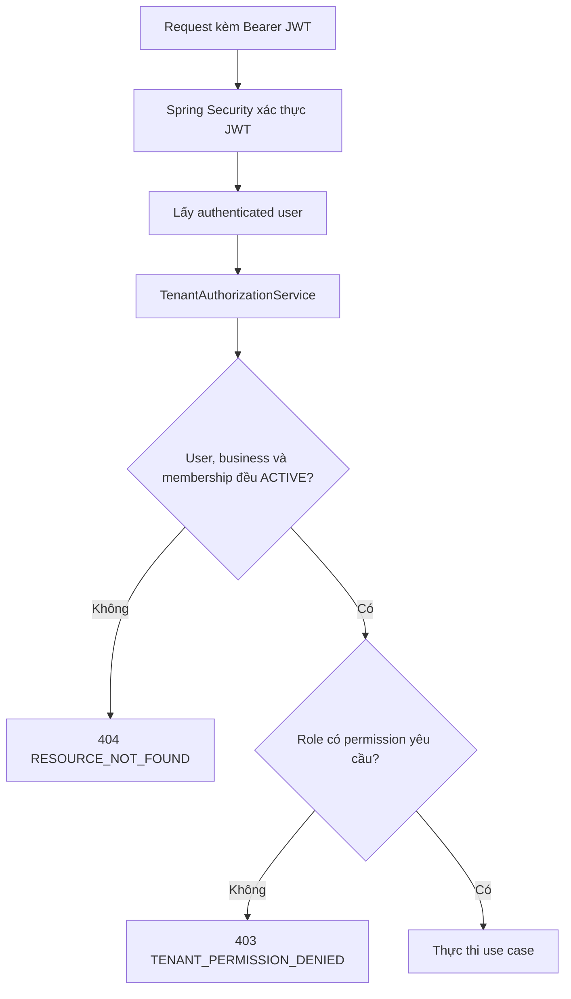

# BOOKFLOW — TỔNG KẾT GIAI ĐOẠN 3

## Multi-tenancy và Authorization cho Business

**Trạng thái:** Completed  
**Phạm vi ticket:** BF-023 đến BF-028  
**Kết quả kiểm tra cuối:** 67/67 test PASS

---

## 1. Mục tiêu của Giai đoạn 3

Sau Giai đoạn 2, BookFlow đã có hệ thống Authentication để đăng ký, đăng nhập và xác định người dùng bằng JWT. Tuy nhiên, hệ thống vẫn chưa có cơ chế phân tách dữ liệu giữa các business.

Giai đoạn 3 giải quyết ba câu hỏi quan trọng:

1. Một người dùng thuộc business nào?
2. Người dùng được xem hoặc thao tác trên business nào?
3. Trong business đó, người dùng được phép làm gì?

Kết quả của giai đoạn này là nền tảng **multi-tenant authorization**: mỗi business là một tenant độc lập; mọi request liên quan đến tenant đều phải kiểm tra membership và quyền hiện tại trong PostgreSQL.

---

## 2. Các vấn đề cần giải quyết

### 2.1. Không được tin dữ liệu định danh từ client

Nếu API nhận `userId` từ query, body hoặc header rồi dùng trực tiếp để truy vấn, người dùng có thể thay ID và truy cập dữ liệu của tài khoản khác.

**Giải pháp:** user hiện tại luôn được lấy từ JWT đã xác thực qua Spring Security và `SecurityContext`. Client không được tự chọn `userId`.

### 2.2. Ngăn truy cập chéo tenant

Nếu chỉ truy vấn business theo `businessId`, người dùng có thể thử UUID của business khác và đọc dữ liệu không thuộc quyền của mình.

**Giải pháp:** business chỉ được trả về khi cùng một truy vấn xác nhận đầy đủ:

- Business tồn tại và đang `ACTIVE`.
- User hiện tại có membership trong business đó.
- Membership đang `ACTIVE`.
- `business_memberships.tenant_id = businesses.id`.

### 2.3. Không làm lộ sự tồn tại của business khác

Nếu API trả `403` cho business thuộc người khác nhưng `404` cho business không tồn tại, kẻ tấn công có thể suy ra UUID nào thực sự tồn tại.

**Giải pháp:** business không tồn tại, business thuộc tenant khác, business inactive hoặc membership inactive đều trả:

```http
404 Not Found
```

với mã lỗi chung `RESOURCE_NOT_FOUND`.

### 2.4. JWT cũ không được giữ quyền đã bị thu hồi

Nếu role và membership chỉ được tin từ JWT, user có thể tiếp tục truy cập cho đến khi token hết hạn dù membership đã bị `SUSPENDED` hoặc `REVOKED`.

**Giải pháp:** trạng thái user, business, membership và role được đọc lại từ PostgreSQL trên mỗi request tenant-scoped. Việc thu hồi quyền có hiệu lực từ request tiếp theo.

### 2.5. Tránh lặp logic phân quyền

Nếu mỗi controller tự kiểm tra membership và role, logic dễ không đồng nhất và có thể bỏ sót tenant isolation ở endpoint mới.

**Giải pháp:** tạo `TenantAuthorizationService` làm cơ chế authorization dùng chung. Các use case gọi service này với permission cần kiểm tra.

---

## 3. Những ticket đã hoàn thành

| Ticket | Nội dung | Kết quả chính |
| --- | --- | --- |
| BF-023 | Schema business và membership | Tạo nền tảng dữ liệu cho business, tenant và role bằng migration V4. |
| BF-024 | Tạo business | Thêm API tạo business và tự động tạo membership `OWNER/ACTIVE` cho user hiện tại trong cùng transaction. |
| BF-025 | Truy vấn business | Thêm API danh sách và chi tiết; chỉ trả business mà user có membership `ACTIVE`. |
| BF-026 | Tenant authorization dùng chung | Tạo `TenantAuthorizationService`, kiểm tra user, business và membership hiện tại trong database. |
| BF-027 | Role authorization | Xây dựng permission matrix cho `OWNER`, `ADMIN` và `STAFF`. |
| BF-028 | Security audit và regression | Kiểm thử tenant isolation, chuẩn hóa `401/403/404` và hoàn thiện tài liệu Giai đoạn 3. |

---

## 4. Mô hình dữ liệu tenant

Hai bảng trung tâm của giai đoạn này là:

- `businesses`: lưu thông tin business.
- `business_memberships`: liên kết user với business, đồng thời lưu role và trạng thái membership.

Quan hệ quan trọng:

```text
business_memberships.tenant_id = businesses.id
```

`tenant_id` chính là ID của business, không có cột `business_id` riêng trong membership.

Một business có thể có nhiều thành viên và một user có thể tham gia nhiều business. Quyền của user không được xác định chỉ bằng JWT mà phụ thuộc vào membership hiện tại trong từng business.

---

## 5. Các API đã triển khai

### 5.1. Tạo business — BF-024

```http
POST /api/v1/businesses
```

Khi tạo business:

1. Xác thực JWT và lấy user hiện tại từ `SecurityContext`.
2. Validate dữ liệu business.
3. Tạo bản ghi trong `businesses`.
4. Tạo membership cho user với role `OWNER` và trạng thái `ACTIVE`.
5. Thực hiện cả hai thao tác trong cùng một transaction.

Nếu tạo business thành công nhưng tạo membership thất bại, transaction rollback để không sinh business không có owner.

Slug bị trùng được trả về `409 Conflict`. Endpoint mutation tiếp tục tuân theo CSRF configuration hiện tại.

### 5.2. Lấy danh sách business — BF-025

```http
GET /api/v1/businesses
```

API chỉ trả các business thỏa mãn:

```text
membership.user_id = authenticated user
membership.status = ACTIVE
business.status = ACTIVE
membership.tenant_id = business.id
```

Danh sách có thứ tự ổn định theo `created_at`, sau đó theo `id`. Response chỉ chứa membership của chính authenticated user.

### 5.3. Lấy chi tiết business — BF-025

```http
GET /api/v1/businesses/{businessId}
```

Business chỉ được trả về khi user hiện tại có membership `ACTIVE` trong business đó. Biết UUID của tenant khác không giúp user truy cập được dữ liệu.

UUID sai định dạng trả `400 Bad Request` thay vì để lỗi conversion trở thành `500`.

---

## 6. Luồng tenant authorization



`TenantAuthorizationService` thực hiện kiểm tra bằng PostgreSQL trên mỗi request tenant-scoped:

1. Xác minh user trong JWT vẫn tồn tại và đang `ACTIVE`.
2. Join `business_memberships` với `businesses`.
3. Lọc đúng authenticated user.
4. Chỉ chấp nhận business và membership đang `ACTIVE`.
5. Lấy role hiện tại từ membership trong database.
6. Kiểm tra role có permission mà use case yêu cầu hay không.

BF-025 đã được chuyển sang sử dụng service chung với permission `BUSINESS_VIEW`.

---

## 7. Permission matrix

| Permission | OWNER | ADMIN | STAFF |
| --- | :---: | :---: | :---: |
| `BUSINESS_VIEW` | Có | Có | Có |
| `BUSINESS_CONFIGURATION_MANAGE` | Có | Có | Không |
| `MEMBERSHIP_STAFF_MANAGE` | Có | Có | Không |
| `MEMBERSHIP_PRIVILEGED_MANAGE` | Có | Không | Không |
| `BUSINESS_CLOSE` | Có | Không | Không |

Ý nghĩa:

- `OWNER`: toàn quyền với business, bao gồm quản lý thành viên đặc quyền và đóng business.
- `ADMIN`: xem và quản lý cấu hình; quản lý staff nhưng không được quản lý quyền đặc biệt hoặc đóng business.
- `STAFF`: chỉ có quyền xem metadata business trong phạm vi hiện tại.

Giai đoạn 3 mới xây dựng và kiểm thử permission matrix tại tầng service. Các API quản trị tương ứng sẽ sử dụng các permission này ở giai đoạn sau.

---

## 8. HTTP error contract

| HTTP status | Error code | Khi nào sử dụng |
| --- | --- | --- |
| `400 Bad Request` | Theo validation contract | UUID hoặc request không hợp lệ. |
| `401 Unauthorized` | Theo Authentication contract | Thiếu JWT, JWT sai hoặc hết hạn. |
| `403 Forbidden` | `TENANT_PERMISSION_DENIED` | User có membership hợp lệ nhưng role không có permission cần thiết. |
| `404 Not Found` | `RESOURCE_NOT_FOUND` | Business không tồn tại, thuộc tenant khác, business inactive hoặc membership inactive. |
| `409 Conflict` | Theo conflict contract | Slug business bị trùng khi tạo business. |
| `500 Internal Server Error` | Theo global error contract | Lỗi không dự kiến; không trả SQL, stack trace hoặc dữ liệu nhạy cảm. |

Điểm quan trọng là `403` chỉ được dùng sau khi hệ thống đã xác nhận user có một membership hợp lệ nhưng thiếu quyền. Các trường hợp có thể làm lộ tenant đều dùng cùng một phản hồi `404`.

---

## 9. Cách bảo đảm tenant isolation

Tenant isolation không được xử lý bằng cách load dữ liệu rồi lọc trong Java. Điều kiện authorization là một phần của truy vấn PostgreSQL.

Ý tưởng truy vấn:

```sql
SELECT
    b.id,
    b.name,
    b.slug,
    b.type,
    b.time_zone,
    b.status,
    m.role AS membership_role,
    m.status AS membership_status
FROM businesses b
JOIN business_memberships m
    ON m.tenant_id = b.id
WHERE b.id = :businessId
  AND m.user_id = :authenticatedUserId
  AND m.status = 'ACTIVE'
  AND b.status = 'ACTIVE';
```

SQL thực tế tuân theo schema và convention trong repository. Các nguyên tắc được giữ:

- Dùng named parameter hoặc prepared statement.
- Không nối chuỗi SQL từ input.
- Không dùng `SELECT *`.
- Không truy vấn membership của user khác.
- Không có N+1 query.
- Không tin role claim do client hoặc JWT cũ cung cấp.

---

## 10. Kiến trúc triển khai

Trách nhiệm được tách như sau:

- **Controller:** nhận request, path parameter và trả response; không chứa SQL hoặc logic tenant phức tạp.
- **Application/Query service:** điều phối use case tạo hoặc đọc business.
- **TenantAuthorizationService:** xác minh tenant membership và permission dùng chung.
- **JDBC repository:** truy vấn PostgreSQL bằng điều kiện tenant isolation.
- **DTO/Response:** chỉ trả các trường an toàn theo API contract.
- **Global exception handler:** chuẩn hóa lỗi `400`, `401`, `403`, `404`, `409` và `500`.

Các quyết định kỹ thuật:

- Tiếp tục dùng Spring JDBC; không thêm JPA/Hibernate.
- Không dùng `ThreadLocal` tenant context.
- Không nhận `X-Tenant-Id` như nguồn tin cậy.
- Không dùng Redis cho authorization.
- Không thêm production dependency.
- Không sửa migration V4 đã áp dụng.

---

## 11. Kiểm thử đã thực hiện

Unit test và integration test bằng PostgreSQL Testcontainers + Flyway thật đã kiểm tra các nhóm hành vi sau.

### Authentication

- Thiếu JWT bị trả `401`.
- JWT sai hoặc hết hạn bị từ chối theo Authentication contract.
- User ID được lấy từ JWT, không lấy từ request.
- User không còn `ACTIVE` bị từ chối.

### Tạo business

- Tạo business và membership `OWNER/ACTIVE` trong cùng transaction.
- Slug trùng trả `409`.
- Validation và CSRF hoạt động đúng.

### Business query

- User chưa có membership nhận danh sách rỗng.
- User chỉ thấy các business mình được phép đọc.
- Business của user khác không xuất hiện.
- Membership `SUSPENDED` hoặc `REVOKED` không được đọc.
- Business không `ACTIVE` không được đọc.
- Response chỉ chứa membership của authenticated user.
- UUID không hợp lệ trả `400`.

### Tenant isolation và role

Test tạo tối thiểu hai user và hai business độc lập:

```text
User A -> Business A
User B -> Business B
```

Sau đó chứng minh:

- User A chỉ thấy Business A.
- User A không thể đọc Business B dù biết UUID.
- User B chỉ thấy Business B.
- `OWNER`, `ADMIN`, `STAFF` được cho phép hoặc từ chối đúng permission matrix.
- Membership bị thu hồi làm mất quyền ngay ở request tiếp theo dù JWT còn hạn.
- Phản hồi không làm lộ tên, slug, role hoặc membership của tenant khác.

### Regression

- Authentication vẫn hoạt động đúng.
- BF-024 và BF-025 không bị regression.
- Migration/schema test vẫn pass.
- Không thay đổi CSRF/JWT behavior ngoài phạm vi.

---

## 12. Kết quả hoàn tất

```text
mvnw clean verify: PASS
Surefire: 25 test, 0 failure, 0 error, 0 skipped
Failsafe/Testcontainers: 42 test, 0 failure, 0 error, 0 skipped
Tổng: 67 test PASS
git diff --check: PASS
Secret scan: PASS
```

Không có:

- Migration mới.
- Production dependency mới.
- Testcontainer còn chạy sau khi kiểm thử.
- Commit, push hoặc pull request tự động.
- Blocker còn tồn tại.

PostgreSQL và Redis Compose vẫn healthy sau khi hoàn thành kiểm tra.

---

## 13. Giá trị đạt được sau Giai đoạn 3

Trước Giai đoạn 3, Authentication chỉ trả lời được: **“Bạn là ai?”**

Sau Giai đoạn 3, BookFlow trả lời thêm được:

- **“Bạn thuộc business nào?”** — thông qua membership.
- **“Bạn có được truy cập business này không?”** — thông qua tenant isolation.
- **“Bạn được làm gì trong business này?”** — thông qua permission matrix.
- **“Quyền vừa bị thu hồi có còn dùng được không?”** — không, vì database được kiểm tra trên mỗi request.

Đây là lớp bảo mật nền tảng để các module lịch làm việc, dịch vụ, nhân viên, booking và thanh toán ở những giai đoạn sau không đọc hoặc thay đổi nhầm dữ liệu giữa các tenant.

---

## 14. Phạm vi chưa triển khai

Các nội dung sau được chủ động để lại cho giai đoạn sau:

- Cập nhật hoặc đóng business.
- Quản lý thành viên và thay đổi role.
- Invitation và chuyển quyền owner.
- Tenant context toàn cục.
- Frontend chọn business và quản trị business.
- Redis/cache cho business query.
- Các API domain như service, staff schedule, booking và payment.

---

## 15. Cách trình bày ngắn gọn khi phỏng vấn

> Ở Giai đoạn 3 của BookFlow, em xây dựng nền tảng multi-tenant authorization. Em tạo schema business và membership, API tạo và truy vấn business, sau đó xây dựng `TenantAuthorizationService` dùng chung. Mỗi request tenant-scoped lấy user từ JWT nhưng vẫn kiểm tra lại user, business, membership và role trong PostgreSQL. Nhờ đó, user không thể truy cập business khác dù biết UUID và membership bị thu hồi có hiệu lực ngay cả khi token cũ còn hạn. Em cũng xây dựng permission matrix cho OWNER, ADMIN, STAFF và kiểm thử tenant isolation bằng PostgreSQL Testcontainers. Kết quả cuối cùng là 67 test đều pass.

